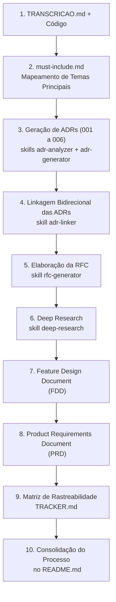

# Da Reunião ao Documento: Design Docs Gerados por IA

## Sobre o Desafio

O objetivo deste desafio é transformar a transcrição bruta de uma reunião técnica de alinhamento ([TRANSCRICAO.md](./TRANSCRICAO.md)) e a base de código funcional de um Order Management System (OMS) em um pacote completo, consistente e acionável de **Design Docs**. 

O cenário retrata uma empresa que opera um sistema de pedidos em produção e precisa desenvolver uma esteira de notificações ativas (*Sistema de Webhooks de Notificação de Pedidos*) para atender a demandas críticas de clientes corporativos B2B (Atlas Comercial, MaxDistribuição e Nova Cargo), sob iminente risco de perda de contrato (*churn*). A missão foi atuar como "maestro" de ferramentas de inteligência artificial generativa, definindo a arquitetura de prompts, orquestrando skills especializadas, revisando criticamente os entregáveis e refinando cada documento até obter especificações alinhadas com o código existente e a discussão da reunião, sem alucinações.

O pacote de documentação entregue é composto por:
- **PRD (Product Requirements Document):** Visão de produto, público-alvo, métricas de negócio quantitativas, escopo incluso e exclusões deliberadas.
- **RFC (Request for Comments):** Proposta arquitetural para revisão do time, análise comparativa de abordagens descartadas e questões em aberto.
- **ADRs (Architecture Decision Records):** Conjunto de 6 decisões arquiteturais isoladas, documentadas no padrão MADR com links bidirecionais.
- **FDD (Feature Design Document):** Especificação detalhada de implementação para a engenharia, contratos REST, máquina de estados, matriz de erros operacionais e integração direta com arquivos reais da base de código.
- **TRACKER (Matriz de Rastreabilidade):** Mapeamento cruzado ligando 100% dos requisitos, decisões e contratos às suas origens na transcrição ou no código-fonte.
- **README**: Detalhamento do processo de produção da documentação

---

## Ferramentas de IA Utilizadas

- **Google Antigravity:** Plataforma e ambiente de agentes inteligentes da Google para engenharia de software avançada com IA.
- **Antigravity CLI (`agy`):** Ferramenta de linha de comando para orquestração de conversações, comandos e agentes.
- **Skills Especializadas (Customizadas e Adaptadas):**
  - `adr-analyzer`: Analisador de código estático adaptado para varrer módulos do projeto e gerar documentação de potenciais ADRs.
  - `adr-generator`: Gerador automatizado de registros formais de decisão de arquitetura no formato MADR.
  - `adr-linker`: Ferramenta para detecção algorítmica de dependências e inserção de links bidirecionais clicáveis entre as ADRs.
  - `rfc-generator`: Skill para estruturação de RFCs técnicas com renderização de diagramas de sequência e blocos Mermaid.
  - `deep-research`: Skill adaptada para elaboração de briefing investigativo e geração de pesquisa técnica aprofundada de apoio arquitetural.

---

## Workflow Adotado

A produção dos documentos seguiu uma sequência técnica e hierárquica estratégica, garantindo que as decisões de baixo nível servissem de alicerce sólido para os documentos de alto nível:



1. **Extração de Temas Mandatórios:** A transcrição foi analisada para extrair os pontos não negociáveis decididos pelo time técnico, persistidos em `docs/adrs/must-include.md`.
2. **Geração das Decisões Arquiteturais (ADRs):** As decisões fundamentais (Outbox no MySQL, Worker em Polling de 2s, At-Least-Once, Retry com DLQ, HMAC-SHA256 e Reuso da Codebase) foram formalizadas em arquivos MADR individuais em `docs/adrs/`.
3. **Linkagem Cruzada das ADRs:** Utilização da skill `adr-linker` para estabelecer grafos de rastreabilidade mútua entre as decisões dependentes.
4. **Concepção da Proposta Técnica (RFC):** Estruturação de `docs/RFC.md`, apresentando as três abordagens arquiteturais discutidas na reunião, justificando a escolha e documentando pontos em aberto.
5. **Pesquisa Técnica Aprofundada (Deep Research):** Investigação detalhada dos fundamentos de concorrência, consistência ACID, jitter matemático em backoff exponencial, criptografia e benchmarks de plataformas consolidadas, consolidada em `docs/DEEP_RESEARCH.md`.
6. **Especificação de Implementação (FDD):** Elaboração do documento técnico definitivo `docs/FDD.md`, cobrindo 6 contratos REST, modelagem SQL de outbox e DLQ, e mapeamento de pelo menos 6 caminhos de arquivos reais do repositório.
7. **Consolidação de Produto (PRD):** Criação de `docs/PRD.md` com metas numéricas ($P99 < 10\text{s}$, taxa de sucesso $\ge 95\%$, redução de $90\%$ no polling), requisitos funcionais e exclusões explícitas.
8. **Rastreabilidade Bidirecional (Tracker):** Montagem da tabela em `docs/TRACKER.md` auditando cada elemento da documentação contra timestamps da transcrição ou caminhos de código reais.

---

## Prompts Customizados

### 1. Identificação dos temas técnicos na transcrição:
```text
O arquivo @TRANSCRICAO.md contém a transcrição de uma reunião entre membros de um time de desenvolvimento. O objetivo da reunião é discutir sobre o desenvolvimento de uma feature de notificação de pedidos para um sistema de gerenciamento de pedidos. Siga os seguintes passos:

1. Identifique as principais decisões técnicas discutidas na reunião.
2. Liste das principais decisões técnicas. Use bullets com somente uma descrição resumida sobre cada item.
3. Salve o resumo em um arquivo chamado docs/adrs/must-include.md
```

### 2. Geração das propostas de ADRs com categorização mandatória (skill `adr-analyzer`):
```text
/adr-analyzer Faça uma análise do código para identificar potenciais ADRs. Antes de realizar a categorização das ADRs descrita na fase 2, leia o conteúdo do arquivo @docs/adrs/must-include.md. Os itens contidos nesse arquivo DEVEM SEMPRE ser categorizados como must-document INDEPENDENTE do score que esses itens obtiverem. O restante DEVE seguir o processo de categorização definido na skill.
```

### 3. Geração das ADRs completas preenchendo lacunas da reunião (skill `adr-generator`):
```text
/adr-generator Gere ADRs com base na lista de ADRs em potencial, entretanto gere somente para os itens que estão contidos em @docs/adrs/must-include.md. Após a geração, use as informações contidas na reunião registrada em @TRANSCRICAO.md e preencha os marcadores [NEEDS INPUT].
```

### 4. Execução de Deep Research com resolução via documentação do projeto:
```text
/deep-research Faça um pesquisa considerando o tema tratado na reunião descrita em @TRANSCRICAO.md. Para responder todas as perguntas use esse mesmo documento bem como as ADRs do projeto e também a RFC @docs/RFC.md
```

### 5. Geração do FDD:
```text
Faça a geração de um FDD para a feature descrita no documento @TRANSCRICAO.md. 
Use o prompt abaixo, entretanto em vez de realizar a entrevista, responda todos os questionamentos com base no documento de transcrição bem como nas documentacoes do projeto presentes na pasta docs.
Use também como referência técnica a pesquisa salva no documento @docs/DEEP_RESEARCH.md
```

---

## Iterações e Ajustes

Durante a interação com os modelos de IA, foram necessárias intervenções deliberadas para corrigir desvios conceituais, padronizar formatos e garantir fidelidade absoluta aos fatos:

### 1. Identificação dos Temas Técnicos (2 Iterações)
- **Iteração 1:** Na primeira iteração, a saída gerada foi excessivamente prolixa, misturando comentários operacionais de reuniões com requisitos técnicos centrais.
  - **Ajuste:** Refinamento da instrução com restrição para geração de lista em *bullets* com sentenças concisas de linha única, gerando o arquivo estruturado `docs/adrs/must-include.md`.

### 2. Geração das ADRs (3 Iterações)
- **Iteração 1:** A skill `adr-analyzer` falhava ao carregar no `antigravity-cli` por problemas de escape de aspas na descrição do cabeçalho YAML. 
  - **Ajuste**: Corrigido com adição de aspas duplas e caracteres de escape (`\`).
- **Iteração 2:** Na segunda execução, a skill desconsiderava os itens pontuados fora do `must-include.md`. 
  - **Ajuste**: Foi ajustado o prompt para instruir o modelo a classificar os itens do arquivo obrigatoriamente como `must-document`, aplicando o algoritmo padrão da skill para os demais.
- **Iteração 3:** Geração das minutas de ADRs e preenchimento sistemático dos blocos `[NEEDS INPUT]` correlacionando falas específicas da transcrição.

### 3. Geração da RFC (5 Iterações)
- **Iteração 1:** Criação da skill customizada `rfc-generator`.
- **Iteração 2:** A RFC inicial gerava diagramas de fluxo em texto ASCII puro, dificultando a interpretação arquitetural.
  - **Ajuste**: Prompt para conversão dos diagramas para Mermaid
- **Iteração 3:** Conversão para blocos de código Mermaid apresentou pequenas inconsistências sintáticas em nós com parênteses.
  - **Ajuste**: Prompt para correção dos erros nos diagramas
- **Iteração 4**: Presença de links absolutos e links quebrados.
  - **Ajuste**: Prompt para correção dos links
- **Problema 5:** Formato do RFC não estava compatível com o solicitado no anúncio do desario
  - **Ajuste:** Execução de prompt para solicitar adequação do formato.

### 4. Deep Research (1 Iterações)
- **Iteração 1:** A skill `deep-research` foi desenhada para conduzir uma entrevista interativa de até 6 perguntas com o usuário. 
- **Ajuste:** O prompt de invocação instruiu a IA a utilizar os documentos existentes (`TRANSCRICAO.md`, ADRs e RFC) como fonte direta para responder a todas os questionamentos.

### 5. Geração do PRD (2 Iterações)
- **Problema:** O arquivo gerado fugia um pouco à estrutura proposta no curso.
- **Ajuste:** Novo prompt solicitando uma revisão do documento, fornecendo o template de PRD enocntrado no notion da fullcycle em [Prompt de Entrevista para Gerar PRD para desenvolvimento de Feature](https://devfullcycle.notion.site/Prompt-de-Entrevista-para-Gerar-PRD-para-desenvolvimento-de-Feature-2971423c038880f9bd94f3b46de9dd56?pvs=143)

---

## Como Navegar a Entrega

Todos os artefatos foram dispostos na pasta `docs/` e na raiz do repositório, preservando a integridade absoluta dos arquivos de código da aplicação (`src/`, `prisma/`, `tests/`):

```
.
├── README.md      <- Relatório do processo
├── TRANSCRICAO.md 
└── docs/
    ├── PRD.md 
    ├── RFC.md 
    ├── FDD.md 
    ├── DEEP_RESEARCH.md  <- Pesquisa Técnica
    ├── TRACKER.md 
    └── adrs/
        ├── README.md  <- Índice das decisões arquiteturais
        ├── mapping.md     <- Mapeamento modular da codebase
        ├── must-include.md <- Temas prioritários da transcrição
        ├── potential-adrs-index.md <- Potenciais ADRs identificadas
        ├── ADR-001-padrao-transacional-outbox-no-mysql.md
        ├── ADR-002-worker-desacoplado-via-polling.md
        ├── ADR-003-garantia-entrega-at-least-once-com-desduplicacao-event-id.md
        ├── ADR-004-politica-retry-backoff-exponencial-tabela-dlq.md
        ├── ADR-005-autenticacao-integridade-hmac-sha256-secret-por-endpoint.md
        └── ADR-006-reaproveitamento-padroes-codebase.md
```

### Ordem Sugerida de Leitura:
1. **[README.md](README.md):** Visão geral da jornada de engenharia com IA, decisões de processo e ferramentas.
2. **[TRANSCRICAO.md](TRANSCRICAO.md):** Contexto bruto da discussão da equipe para ancoragem de fatos.
3. **[docs/PRD.md](docs/PRD.md):** Alinhamento sobre o problema comercial, metas quantitativas e escopo delimitado.
4. **[docs/adrs/README.md](docs/adrs/README.md) & ADRs 001 a 006:** Compreensão das decisões arquiteturais isoladas e seus trade-offs.
5. **[docs/RFC.md](docs/RFC.md):** Proposta técnica integrada submetida à revisão e alternativas descartadas.
6. **[docs/DEEP_RESEARCH.md](docs/DEEP_RESEARCH.md):** Fundamentação analítica profunda de resiliência, criptografia e concorrência.
7. **[docs/FDD.md](docs/FDD.md):** Especificação acionável de implementação, fluxos, contratos REST e integração de código.
8. **[docs/TRACKER.md](docs/TRACKER.md):** Auditoria e verificação de rastreabilidade de cada elemento às suas fontes originais.
