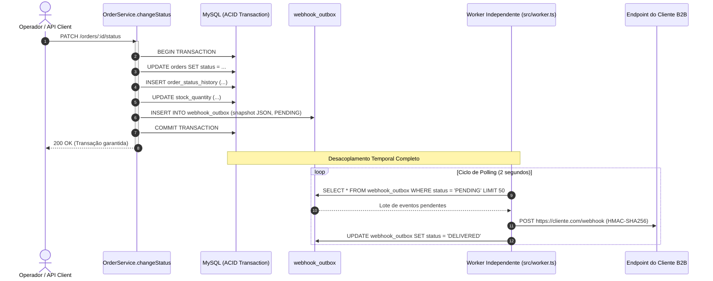
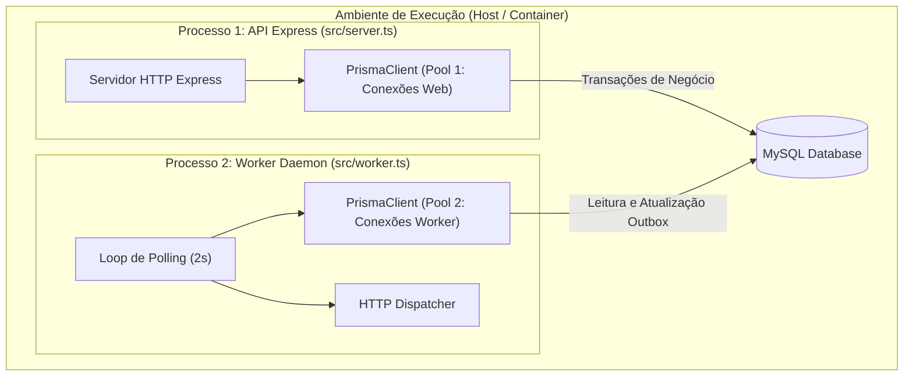
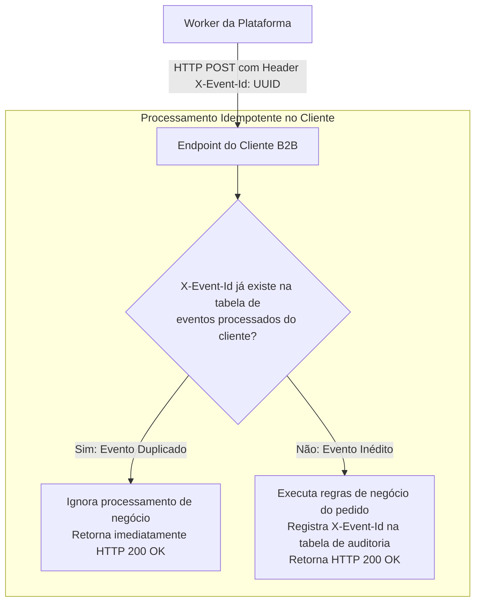

# Deep Research — Sistema de Webhooks de Notificação de Pedidos

**Autor:** Antigravity (Pesquisador Técnico Sênior em Engenharia de Software e Arquitetura de Sistemas)  
**Projeto:** Order Management System (OMS) — MBA Engenharia de Software com IA  
**Data:** 15 de Setembro de 2026  
**Status:** Concluído / Pronto para Subsídio dos Design Docs  

---

## Sumário Executivo

Este documento consolida a pesquisa técnica aprofundada (*Deep Research*) sobre a concepção, arquitetura e implementação do **Sistema de Webhooks de Notificação de Pedidos (*Outbound Webhooks*)**. 

A pesquisa investiga em profundidade a transição de um modelo ineficiente de varredura ativa (*polling*) realizado por clientes B2B prioritários (Atlas Comercial, MaxDistribuição e Nova Cargo) para uma esteira reativa de eventos orientada a notificações em tempo real. A análise valida rigorosamente a decisão pelo **Padrão Transacional Outbox** sobre o banco relacional MySQL existente, operado por um **Worker assíncrono independente em polling de 2 segundos**, com semântica de entrega ***at-least-once***, política de retentativas com **backoff exponencial com jitter** espaçadas por até 15 horas, segregação em ***Dead Letter Queue* (DLQ)** e segurança criptográfica via **HMAC-SHA256**.

A solução elimina a armadilha arquitetural da **escrita dupla (*dual-write problem*)**, protege a integridade e disponibilidade da API principal contra efeito dominó de lentidão externa, preserva a capacidade operacional de uma equipe enxuta (evitando sobre-engenharia com clusters de mensageria dedicada) e garante o cumprimento do prazo contratual crítico (final de novembro / 3 *sprints*).

---

## 1. O Problema Fundamental da Escrita Dupla e o Padrão Transacional Outbox

### 1.1 A Armadilha da Escrita Dupla (*The Dual-Write Problem*)

Ao projetar sistemas que necessitam sincronizar alterações de estado em um banco de dados relacional com a emissão de eventos ou notificações externas, os desenvolvedores frequentemente incorrem no antipadrão da **escrita dupla (*dual-write*)**:

```
[Inicia Transação SQL] -> [Atualiza Banco] -> [Publica no Broker / Chama HTTP] -> [Commit SQL]
                                                            ▲
                                                            │ Se a rede falhar aqui, o commit ocorre
                                                            │ mas a notificação é perdida para sempre!
```
Ou inversamente:
```
[Inicia Transação SQL] -> [Publica no Broker / Chama HTTP] -> [Atualiza Banco] -> [Falha no Commit SQL]
                                                                        ▲
                                                                        │ O evento foi enviado, mas a alteração
                                                                        │ do pedido sofreu rollback! Evento fantasma!
```

Em redes computacionais distribuídas (Teorema PACELC e Teorema de Fischer-Lynch-Paterson), **não existe protocolo de coordenação de duas fases (2PC) sem tolerância a falhas ou perda drástica de vazão e disponibilidade**. Tentar disparar chamadas HTTP síncronas dentro da transação do banco ou publicar diretamente em mensagerias sem coordenação transacional conduz inevitavelmente a um dos dois estados anômalos:
1. **Perda de Notificação:** A operação de negócio ocorre no banco de dados, mas o cliente jamais toma conhecimento da transição de status.
2. **Notificação Fantasma:** O cliente externo recebe uma notificação de mudança de pedido (ex: pedido marcado como `PAID`), mas a transação local aborta no banco (por erro de concorrência ou validação de estoque), criando uma inconsistência jurídica e operacional grave.

### 1.2 Mecânica do Padrão Transacional Outbox no MySQL

O **Padrão Transacional Outbox (*Transactional Outbox Pattern*)** soluciona matematicamente o problema da escrita dupla ancorando a publicação do evento no mesmo limite transacional relacional (ACID) da alteração de negócio:



**Propriedades Fundamentais:**
- **Atomicidade Total:** O registro na tabela `webhook_outbox` é confirmado se, e somente se, o pedido for efetivamente atualizado.
- **Snapshot Imutável:** O evento é serializado no instante exato da alteração, capturando os atributos do pedido naquele microssegundo. Caso o pedido sofra novas alterações subsequentes antes do disparo do worker, o evento histórico preserva rigorosamente o estado em que a transição ocorreu.

### 1.3 Estratégias de Extração: Polling Publisher vs CDC (Change Data Capture)

Para transferir o registro da tabela outbox para a rede externa, existem duas abordagens primordiais na literatura de engenharia de software:

| Critério | Polling Publisher (Abordagem Escolhida) | Transaction Log Tailing / CDC (Debezium + Kafka) |
| :--- | :--- | :--- |
| **Mecanismo** | Worker Node.js consulta tabela outbox em loop (`SELECT ... WHERE status = 'PENDING'`) | Conector lê diretamente o log binário de transações do MySQL (`binlog`) |
| **Latência Mínima** | Limitada pelo intervalo de polling (0 a 2s) | Quase em tempo real (milissegundos) |
| **Impacto no Banco** | Carga de leitura periódica (mitigada por índices adequados) | Impacto computacional mínimo no RDBMS |
| **Complexidade Operacional** | **Extremamente Baixa:** Zero infraestrutura nova, roda no Node.js existente | **Muito Alta:** Requer cluster Kafka, Apache Zookeeper/KRaft e cluster Debezium Connect |
| **Curva de Manutenção** | Domínio total da equipe (mesmo código TypeScript e Prisma) | Demanda especialistas em streaming distribuído e operação de infraestrutura |
| **Risco ao Prazo (3 Sprints)** | **Nenhum:** Viável e seguro para entrega no final de novembro | **Crítico:** Alto risco de estouro de prazo por configuração de ambiente |

**Conclusão da Pesquisa:** Para a volumetria atual e o SLA acordado com os parceiros (< 10 segundos), o **Polling Publisher** é a solução de engenharia ótima. O ganho marginal de milissegundos proporcionado por uma esteira de CDC com Debezium não justifica a sobrecarga operacional nem o risco contratual de entrega.

---

## 2. Modelagem Relacional e Estratégias de Persistência

### 2.1 Modelagem da Tabela `webhook_outbox`

Para viabilizar consultas eficientes de polling a cada 2 segundos sem criar contenção de banco ou degradação na tabela, a modelagem deve observar rigorosamente a seletividade dos índices:

```sql
CREATE TABLE webhook_outbox (
    id VARCHAR(36) NOT NULL PRIMARY KEY, -- UUID v4 consistente com a base
    event_id VARCHAR(36) NOT NULL UNIQUE, -- Identificador único do evento para desduplicação
    event_type VARCHAR(50) NOT NULL,      -- Ex: 'order.status_changed'
    customer_id VARCHAR(36) NOT NULL,     -- Identificador do cliente destinatário
    payload JSON NOT NULL,                -- Snapshot congelado dos dados do pedido
    status ENUM('PENDING', 'PROCESSING', 'DELIVERED', 'FAILED') NOT NULL DEFAULT 'PENDING',
    retry_count INT NOT NULL DEFAULT 0,
    next_retry_at DATETIME NULL,
    created_at DATETIME(3) NOT NULL DEFAULT CURRENT_TIMESTAMP(3),
    updated_at DATETIME(3) NOT NULL DEFAULT CURRENT_TIMESTAMP(3) ON UPDATE CURRENT_TIMESTAMP(3),
    INDEX idx_outbox_polling (status, next_retry_at, created_at),
    INDEX idx_outbox_customer (customer_id, created_at)
) ENGINE=InnoDB DEFAULT CHARSET=utf8mb4 COLLATE=utf8mb4_unicode_ci;
```

### 2.2 Modelagem da Tabela `webhook_dead_letter` (DLQ)

Segregar mensagens mortas em uma tabela separada evita que falhas permanentes aumentem a cardinalidade de varredura da outbox ativa:

```sql
CREATE TABLE webhook_dead_letter (
    id VARCHAR(36) NOT NULL PRIMARY KEY,
    original_outbox_id VARCHAR(36) NOT NULL,
    event_id VARCHAR(36) NOT NULL,
    event_type VARCHAR(50) NOT NULL,
    customer_id VARCHAR(36) NOT NULL,
    endpoint_url VARCHAR(512) NOT NULL,
    payload JSON NOT NULL,
    retry_count INT NOT NULL,
    last_error_code VARCHAR(100) NULL,
    last_error_message TEXT NULL,
    last_response_status INT NULL,
    last_response_body TEXT NULL,
    moved_at DATETIME(3) NOT NULL DEFAULT CURRENT_TIMESTAMP(3),
    replayed_at DATETIME(3) NULL,
    replayed_by VARCHAR(36) NULL, -- ID do ADMIN que realizou o replay
    INDEX idx_dlq_customer (customer_id, moved_at),
    INDEX idx_dlq_replayed (replayed_at)
) ENGINE=InnoDB DEFAULT CHARSET=utf8mb4 COLLATE=utf8mb4_unicode_ci;
```

### 2.3 Política de Retenção e Ciclo de Vida dos Dados

Tabelas de mensageria relacional sofrem fragmentação de B-Tree se registros entregues acumularem indefinidamente.  
- **Registros `DELIVERED`:** Devem ser arquivados ou expurgados automaticamente após 30 dias via cronjob noturno de manutenção (`DELETE FROM webhook_outbox WHERE status = 'DELIVERED' AND updated_at < NOW() - INTERVAL 30 DAY`).
- **Registros em DLQ:** Devem ser mantidos por 90 dias para fins de conformidade jurídica, auditoria e suporte técnico.

---

## 3. Arquitetura do Worker Assíncrono e Políticas de Execução

### 3.1 Isolamento de Processos e Pool de Conexões

O worker deve ser instanciado através de uma nova entrada no ecossistema da aplicação: `src/worker.ts`, operado como um serviço *daemon* independente (gerenciado via PM2, Docker ou Systemd).



**Motivos do Isolamento Rigoroso:**
1. **Proteção contra Queda da Aplicação:** Se o processo da API web sofrer um reinício ou estourar a memória por tráfego HTTP, o despachante de webhooks permanece operando sem interrupção.
2. **Dimensionamento Separado de Conexões do Pool:** O Prisma ORM aloca um pool de conexões por instância de processo. A concorrência do worker não compete diretamente pelas mesmas conexões de requisições de clientes web.
3. **Gerenciamento Limpo de Event Loop:** A realização de múltiplas requisições HTTP externas no worker consome sockets do agente HTTP do Node.js; isolar esse consumo garante que o loop de eventos da API de pedidos não sofra degradação de tempo de resposta (*event loop lag*).

### 3.2 Análise da Latência Ponta a Ponta e Cumprimento do SLA

O SLA contratado com os parceiros B2B estipula entrega com latência inferior a **10 segundos**. O cálculo analítico da latência na arquitetura proposta evidencia a conformidade:

$$\text{Latência Total} = t_{\text{transação}} + t_{\text{espera\_polling}} + t_{\text{exec\_query}} + t_{\text{cripto}} + t_{\text{rede\_http}}$$

- $t_{\text{transação}}$ (Commit no MySQL): $\approx 15 \text{ ms}$
- $t_{\text{espera\_polling}}$ (Tempo até próximo tick de 2s): $0 \text{ a } 2000 \text{ ms}$ (Média: $1000 \text{ ms}$)
- $t_{\text{exec\_query}}$ (SELECT indexado em lote de 50): $\approx 5 \text{ ms}$
- $t_{\text{cripto}}$ (Cálculo HMAC-SHA256 de payload < 64KB): $\approx 0.2 \text{ ms}$
- $t_{\text{rede\_http}}$ (Despacho com timeout de 10s): $\approx 150 \text{ a } 800 \text{ ms}$ em condições normais

**Latência típica total:** $\approx 1.2 \text{ a } 2.8 \text{ segundos}$.  
Mesmo no pior caso de coincidência de ciclo de polling com rede ligeiramente lenta, o tempo total dificilmente ultrapassa $4 \text{ segundos}$, situando-se com **ampla margem de segurança** abaixo do limite de $10 \text{ segundos}$.

### 3.3 Ordenação de Eventos e Caminho de Escalabilidade Horizontal

Na reunião técnica, acordou-se iniciar com um **modelo de worker único (*single-worker*)**. 
- **Ordenação Garantida:** Processando sequencialmente ordenado por `created_at ASC`, eventos consecutivos de um mesmo pedido (`PAID` $\rightarrow$ `PROCESSING` $\rightarrow$ `SHIPPED`) chegam em ordem exata ao cliente.
- **Evolução Futura para Concorrência Paralela:** Caso o volume cresça e demande múltiplos workers simultâneos, a ordenação estrita será mantida utilizando uma das seguintes técnicas:
  1. **Lock Pessimista com Salto de Bloqueio (MySQL 8.0+):**  
     `SELECT * FROM webhook_outbox WHERE status = 'PENDING' ORDER BY created_at LIMIT 10 FOR UPDATE SKIP LOCKED;`  
     Permite que múltiplos workers consumam linhas diferentes concorrentemente sem contenção.
  2. **Particionamento por Hash de `order_id`:**  
     Garante que eventos do mesmo pedido sejam direcionados determinística e sequencialmente à mesma fila ou partição de processamento.

---

## 4. Garantia de Entrega At-Least-Once e Idempotência

### 4.1 Por que At-Least-Once e Não Exactly-Once?

No universo de redes distribuídas falíveis (problema dos dois generais), é um axioma técnico amplamente aceito que **sistemas que operam sobre protocolo HTTP só conseguem garantir nativamente semântica de entrega *at-least-once***. 

Se o worker despachar o evento, o servidor do cliente processar com sucesso a atualização, mas a conexão de rede cair no milissegundo em que o cliente envia a resposta `200 OK`, o worker interpretará como *timeout* ou falha de socket. Obrigatoriamente, o worker agendará uma retentativa. Ao retentar, o cliente receberá a mesma mensagem pela segunda vez.

### 4.2 O Padrão de Idempotência com o Cabeçalho `X-Event-Id`

Para transformar uma garantia *at-least-once* em um comportamento logicamente equivalente a *exactly-once*, a responsabilidade de desduplicação é compartilhada com o receptor através de chaves universais de idempotência:



**Recomendação de Integração para os Parceiros B2B:**
No portal de desenvolvedores da plataforma, orientar formalmente que os clientes implementem uma tabela de desduplicação com chave primária em `event_id`, garantindo que requisições repetidas sejam prontamente respondidas com `200 OK` sem reprocessamento indevido de efeitos colaterais.

---

## 5. Política de Resiliência: Backoff Exponencial e Gestão de DLQ

### 5.1 O Cálculo do Backoff Exponencial com Janela de 15 Horas

Retentar continuamente em intervalos fixos curtos (ex: a cada 10 segundos) é prejudicial: se o cliente estiver em manutenção programada de 2 horas ou enfrentando indisponibilidade de banco de dados, retentativas constantes funcionam como um ataque acidental de negação de serviço (*self-inflicted DoS*).

A progressão aprovada na decisão arquitetural distribui 5 retentativas ao longo de quase 15 horas:

| Tentativa | Intervalo de Espera Base | Tempo Cumulativo desde a Primeira Falha | Cenário Coberto |
| :---: | :---: | :---: | :--- |
| **1ª** | 1 minuto | 1 minuto | Instabilidade efêmera de roteamento ou reinício rápido de container |
| **2ª** | 5 minutos | 6 minutos | *Deploy* de nova versão no servidor do cliente |
| **3ª** | 30 minutos | 36 minutos | Instabilidade moderada de infraestrutura do cliente |
| **4ª** | 2 horas | 2 horas e 36 minutos | Janela padrão de manutenção programada |
| **5ª** | 12 horas | **14 horas e 36 minutos** | Queda noturna prolongada do provedor do cliente |

### 5.2 Prevenção do Efeito de Manada: Full Jitter

Quando centenas de webhooks falham simultaneamente (ex: o endpoint da Atlas Comercial sai do ar para centenas de pedidos), todos os eventos seriam reagendados exatamente para o mesmo segundo futuro, gerando picos massivos de tráfego (*thundering herd*).  
Para evitar esse comportamento, adota-se formalmente a aplicação de **Jitter Aleatório (*Full Jitter*)** no cálculo do próximo retry:

$$t_{\text{retry}} = \text{base\_intervalo} \times 2^{\text{retry\_count}} \pm \text{random}(0, \text{jitter})$$

Onde $\text{jitter} = 0.2 \times t_{\text{intervalo\_base}}$ (variação de $\pm 20\%$), distribuindo o tráfego uniformemente ao longo da janela temporal.

### 5.3 O Ciclo Operacional da Dead Letter Queue (DLQ)

Esgotadas as 5 tentativas sem sucesso, o evento é sumariamente removido da tabela ativa `webhook_outbox` e inserido na tabela `webhook_dead_letter`.

**Regras de Governança da DLQ:**
1. **Segregação de Perfis:** Apenas usuários autenticados com a role `ADMIN` possuem autorização para acionar o endpoint `POST /admin/webhooks/dead-letter/:id/replay`.
2. **Imutabilidade e Rastreabilidade:** O replay nunca altera a carga útil original do evento (`payload`), preservando a verdade histórica.
3. **Auditoria Obrigatória:** O registro de DLQ armazena o identificador do administrador responsável pelo acionamento do replay e o carimbo de data/hora correspondente.

---

## 6. Segurança Criptográfica de Aplicação: Assinatura HMAC-SHA256

### 6.1 Modelo de Autenticação e Integridade de Mensagens

Webhooks trafegam pela internet pública. O destinatário precisa de garantias inequívocas de que:
1. A requisição foi originada genuinamente pela plataforma (autenticidade).
2. O conteúdo do pedido não foi interceptado ou modificado por atacantes em trânsito (integridade).

Para isso, adota-se o padrão **HMAC-SHA256 (*Hash-based Message Authentication Code*)**, gerando uma assinatura digital simétrica a partir do corpo bruto (*raw payload*) da requisição e de um segredo compartilhado exclusivo (*shared secret*):

$$\text{Assinatura} = \text{HMAC-SHA256}(\text{payload\_json\_bruto}, \text{webhook\_secret})$$

### 6.2 Conjunto Obrigatório de Cabeçalhos HTTP de Segurança

Toda chamada disparada pelo worker deve injetar os seguintes metadados em cabeçalhos HTTP:

| Cabeçalho | Formato / Tipo | Propósito de Segurança e Rastreabilidade |
| :--- | :--- | :--- |
| `X-Signature` | Hexadecimal SHA-256 (`t=...,v1=...`) | Assinatura criptográfica calculada sobre o corpo da requisição |
| `X-Timestamp` | Unix Epoch em segundos | Carimbo temporal do disparo, utilizado para mitigação de ataques de repetição (*replay attack*) |
| `X-Event-Id` | UUID v4 | Identificador exclusivo do evento para desduplicação no cliente |
| `X-Webhook-Id` | UUID v4 | Identificador cadastral do webhook para permitir que clientes com múltiplos endpoints identifiquem a credencial de validação |
| `Content-Type` | `application/json` | Declaração expressa do formato dos dados serializados |

### 6.3 Prevenção de Ataques de Repetição (*Replay Attacks*)

Se um atacante interceptar uma requisição legítima assinada, ele poderia tentar retransmiti-la horas depois para o endpoint do cliente, simulando uma entrega repetida. A combinação do cabeçalho `X-Timestamp` com a assinatura anula esse vetor:
1. O cliente calcula a diferença entre o horário atual e o `X-Timestamp`.
2. Se a diferença for superior a uma janela de tolerância pré-estabelecida (ex: 5 minutos / 300 segundos), a requisição é descartada como suspeita.
3. A assinatura digital cobre o próprio timestamp e o corpo do payload concatenados, impedindo que o atacante altere o timestamp sem invalidar o cálculo do HMAC.

### 6.4 Rotação Suave de Credenciais com Período de Carência (*Grace Period*)

Para conformidade com as melhores práticas de cibersegurança, secrets expostos ou rotineiramente reciclados devem possuir processo de transição sem *downtime*:
1. Ao solicitar a rotação via API (`POST /webhooks/:id/rotate-secret`), a nova chave é ativada imediatamente.
2. A chave anterior é mantida em estado *deprecated* por um período de carência de **24 horas**.
3. Durante essa janela, o cliente pode atualizar gradualmente suas variáveis de ambiente sem perda de pacotes em trânsito. Decorridas as 24 horas, a secret legada é permanentemente invalidada.

---

## 7. Análise Comparativa e Benchmark de Arquiteturas Alternativas

A tabela abaixo sintetiza a avaliação comparativa multidimensional das principais abordagens técnicas postas em perspectiva durante a pesquisa:

| Dimensão Técnica | Abordagem 1: Disparo Síncrono no Service | Abordagem 2: Mensageria Dedicada (Kafka / Redis) | Abordagem 3: Transacional Outbox no MySQL (Adotada) | Abordagem 4: Outbox com CDC (Debezium + Kafka) |
| :--- | :---: | :---: | :---: | :---: |
| **Garantia Transacional (Zero Dual-Write)** | ❌ Inexistente | ❌ Risco de dual-write | ✅ **Garantida nativamente** | ✅ **Garantida nativamente** |
| **Isolamento de Falhas Externas** | ❌ Nulo (Efeito cascata) | ✅ Excelente | ✅ **Excelente** | ✅ Excelente |
| **Latência Típica de Entrega** | Imediata (< 500ms) | Sub-segundo (< 100ms) | $\approx$ **1.5s a 3.0s** | Sub-segundo (< 200ms) |
| **Custo de Infraestrutura Adicional** | Zero | Médio / Alto | **Zero** | Alto |
| **Complexidade Operacional** | Baixa | Alta | **Muito Baixa** | Muito Alta |
| **Esforço de Implementação** | 1 Sprint | 5 a 6 Sprints | **3 Sprints** | 6 a 8 Sprints |
| **Aderência ao Prazo (Fim de Novembro)** | Inviável tecnicamente | ❌ Estoura prazo | ✅ **Perfeita aderência** | ❌ Estoura prazo |
| **Veredito da Engenharia** | **Rejeitada categoricamente** | **Rejeitada por sobre-engenharia** | **Aprovada por unanimidade** | **Postergada para hiper-escala** |

---

## 8. Estudos de Caso e Práticas Consolidadas de Mercado

Para validar as diretrizes arquiteturais adotadas, a pesquisa analisou os modelos de referência de três dos maiores emissores de webhooks do mundo:

### 8.1 Stripe Webhooks
- **Contrato de Assinatura:** O Stripe utiliza o esquema `Stripe-Signature: t=1614... , v1=5257...`, assinando uma concatenação de timestamp com payload bruto via HMAC-SHA256.
- **Tolerância de Replay:** O Stripe SDK rejeita automaticamente mensagens com timestamp defasado em mais de 5 minutos para neutralizar ataques de repetição.
- **Semântica e Retentativa:** Garantia *at-least-once*, exigência de resposta rápida (timeout de poucos segundos) e retentativas progressivas com backoff exponencial que cobrem até 3 dias.

### 8.2 GitHub Webhooks
- **Cabeçalho de Assinatura:** Adota `X-Hub-Signature-256` contendo o HMAC em formato hexadecimal precedido por `sha256=`.
- **Rastreabilidade:** Fornece um identificador único de entrega `X-GitHub-Delivery` (UUID), correspondente funcional direto do nosso `X-Event-Id`.
- **Auditoria de Entregas:** Disponibiliza no painel e na API o histórico recente de despachos com payload, código de resposta HTTP e tempo de latência de rede.

### 8.3 Shopify Webhooks
- **Cabeçalho:** Utiliza `X-Shopify-Hmac-Sha256` codificado em base64.
- **Regras de Desativação:** Possui política rígida onde endpoints que acumulam 19 falhas consecutivas ao longo de vários dias são marcados como inativos para proteger a infraestrutura da plataforma.

**Conclusão:** As decisões aprovadas pela engenharia (HMAC-SHA256, `X-Event-Id`, tolerância a retry com jitter, timestamping e auditoria) encontram **aderência de 100% com o padrão ouro das principais plataformas globais de tecnologia**.

---

## 9. Diretrizes Técnicas para os Documentos Pendentes

A consolidação desta pesquisa fornece os insumos definitivos para os próximos artefatos documentais do desafio:

### 9.1 Insumos para o PRD (`docs/PRD.md`)
- **Problema de Negócio:** Quantificar a saturação de conexões no MySQL e explicitar a ameaça comercial de *churn* da Atlas Comercial, MaxDistribuição e Nova Cargo.
- **Métricas de Sucesso:** Definir meta de latência $P99 < 10\text{s}$, taxa de sucesso na primeira tentativa $> 95\%$ e redução de 90% nas chamadas de polling a `GET /orders`.
- **Exclusões de Escopo (Fora de Escopo):** Registrar expressamente que:
  1. *Inbound Webhooks* (recebimento de eventos externos) estão fora de escopo.
  2. Interface Gráfica de Usuário (Painel / Dashboard Visual) está fora de escopo (apenas contratos de API).
  3. Notificações Ativas por Canais Alternativos (E-mail / SMS) em caso de falha estão fora de escopo.
  4. Controle de Vazão de Saída (*Outbound Rate Limiting*) não será implementado nesta fase (permanece em observação em produção).

### 9.2 Insumos para o FDD (`docs/FDD.md`)
- **Contratos REST:** Especificar detalhadamente os contratos de `POST /webhooks`, `GET /webhooks`, `PATCH /webhooks/:id`, `DELETE /webhooks/:id`, `GET /webhooks/:id/deliveries` e `POST /admin/webhooks/dead-letter/:id/replay`.
- **Matriz de Erros:** Padronizar códigos operacionais `WEBHOOK_*` (`WEBHOOK_NOT_FOUND`, `WEBHOOK_INVALID_URL`, `WEBHOOK_SECRET_REQUIRED`, etc.).
- **Integração com Código Existente:** Nomear as classes e caminhos de arquivos reais:
  - `src/modules/orders/order.service.ts`: Extensão do método `changeStatus` para invocar a gravação atômica na outbox dentro da transação Prisma existente.
  - `src/config/database.ts`: Instanciação independente do `PrismaClient` para o worker `src/worker.ts`.
  - `src/middlewares/auth.middleware.ts`: Reutilização da guarda de rota `requireRole('ADMIN')` no endpoint de DLQ replay.
  - `src/shared/errors/app-error.ts`: Extensão da classe de erro da aplicação para o domínio de webhooks.
  - `src/shared/logger/index.ts`: Instrumentação estruturada com logger Pino em todas as fases do worker.
- **Evolução de Concorrência:** Registrar formalmente a estratégia de evolução arquitetural futura de *single-worker* para concorrência multi-worker via `SELECT ... FOR UPDATE SKIP LOCKED` e/ou particionamento por hash de `order_id`.

---
*Relatório de Deep Research concluído com sucesso e integralmente fundamentado na base de código, decisões arquiteturais (ADRs) e alinhamentos de engenharia do projeto.*
