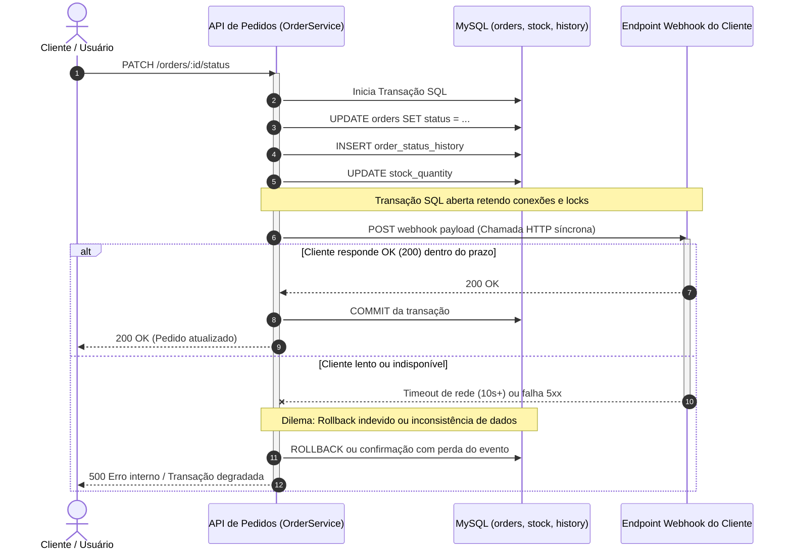
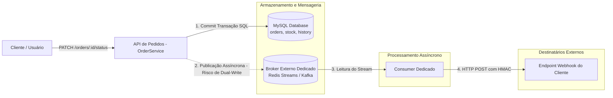
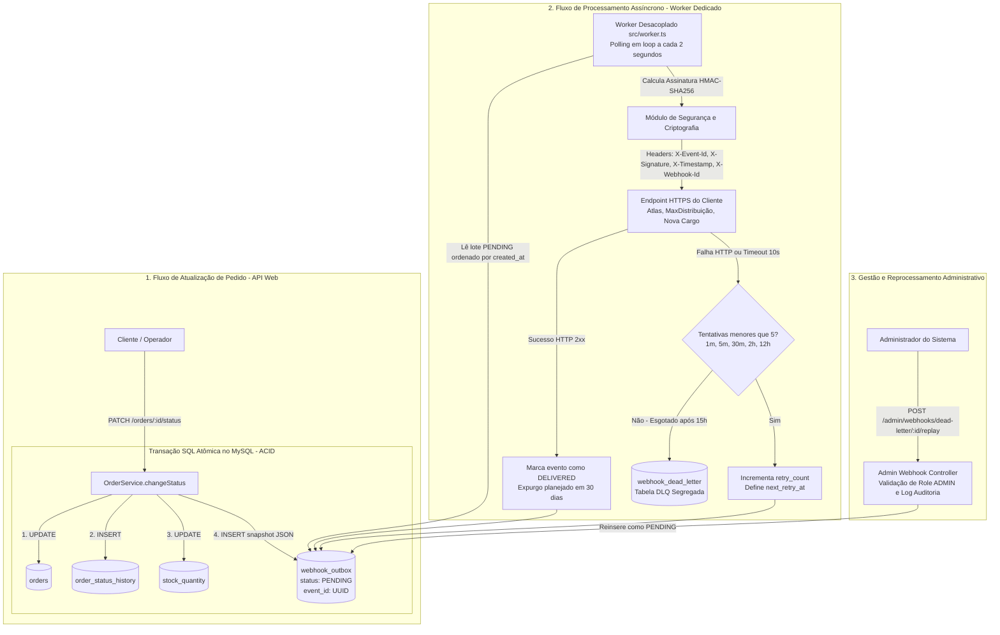

# RFC: Sistema de Webhooks para Notificação de Pedidos

| Field | Value |
|-------|-------|
| **Author(s)** | Larissa (Tech Lead), Bruno (Engenheiro Pleno - Time de Pedidos), Diego (Engenheiro Sênior - Time de Plataforma) |
| **Approver(s)** | Larissa (Tech Lead), Marcos (Product Manager), Sofia (Engenheira de Segurança), Diego (Engenheiro Sênior - Time de Plataforma) |
| **Status** | Aceito |
| **Created** | 2026-09-13 |
| **Last Updated** | 2026-09-15 |
| **Team** | Time de Pedidos & Time de Plataforma |

---

## Abstract

Esta RFC propõe a concepção e implementação de um sistema de notificações assíncronas de saída (*outbound webhooks*) para informar parceiros comerciais e clientes B2B em tempo real sobre mudanças no ciclo de vida de seus pedidos. A solução resolve problemas críticos de saturação de conexões e lentidão na API principal de pedidos provocados por varreduras contínuas (*polling*) de grandes clientes como Atlas Comercial, MaxDistribuição e Nova Cargo, mitigando o risco iminente de evasão contratual (*churn*) para concorrentes. 

O principal *insight* técnico e *trade-off* arquitetural consiste na adoção do padrão Transacional Outbox integrado atomicamente à transação SQL de atualização de pedidos no banco de dados relacional (MySQL), combinado com um worker independente em processo dedicado executando consultas periódicas (*polling*) a cada 2 segundos. Essa abordagem viabiliza consistência atômica e entrega com latência ponta a ponta inferior a 10 segundos sem a necessidade de provisionar e operar novos componentes distribuídos de mensageria (como Apache Kafka ou Redis Cluster), preservando a capacidade operacional de uma equipe enxuta e assegurando o cumprimento do cronograma de três ciclos de desenvolvimento (*sprints*).

---

## Motivation

Atualmente, clientes corporativos B2B integram-se à plataforma consultando periodicamente o endpoint `GET /orders` para verificar se houve alteração de status em seus pedidos em trânsito. Esse modelo de *polling* constante demonstrou-se altamente ineficiente, caro e danoso para ambas as partes:

1. **Degradação de Performance e Custo:** Varreduras contínuas geram consumo desnecessário de conexões com o banco de dados e sobrecarga de CPU na API pública de pedidos, tornando a integração lenta e onerosa para os clientes externos e para a infraestrutura interna.
2. **Pressão Comercial e Risco de Perda de Clientes (*Churn*):** Três clientes prioritários de alta representatividade de faturamento — Atlas Comercial, MaxDistribuição e Nova Cargo — formalizaram uma demanda mandatória para o recebimento de notificações ativas em tempo real. A Atlas Comercial advertiu formalmente que considerará migrar sua operação para uma solução concorrente caso o recurso não seja entregue até o encerramento do trimestre atual (final de novembro de 2026).
3. **Restrições de SLA de Negócio:** A expectativa acordada com os clientes para uma notificação em "tempo real" aceitável é uma latência ponta a ponta estritamente inferior a 10 segundos entre a transição de estado interna e o recebimento pelo consumidor.
4. **Inviabilidade do Acoplamento Síncrono:** O método de transição de estado (`changeStatus`) no serviço central de pedidos (`OrderService`) já executa uma transação SQL pesada que atualiza o registro do pedido (`orders`), grava o histórico de movimentação (`order_status_history`) e debita itens do inventário (`stock_quantity`). Inserir requisições HTTP externas síncronas no meio dessa transação bloquearia conexões e travas de banco com o tempo de resposta de terceiros, enquanto qualquer falha remota colocaria a equipe diante de um falso dilema: reverter uma atualização legítima de pedido ou perder permanentemente a notificação.

Portanto, é mandatório estabelecer uma esteira desacoplada, atômica, altamente resiliente e segura para emissão de webhooks.

---

## Goals and Non-Goals

**Goals:**
- **Latência de Entrega em Tempo Real:** Garantir latência ponta a ponta inferior a 10 segundos para 99% dos eventos de alteração de status de pedidos (`from_status` -> `to_status`), satisfazendo o SLA acordado com os clientes B2B.
- **Consistência Transacional Atômica (Zero Escrita Dupla):** Garantir que nenhuma alteração de status commitada deixe de gerar seu respectivo evento de notificação e que nenhum evento órfão seja emitido se a transação do pedido sofrer *rollback*.
- **Garantia de Entrega *At-Least-Once* com Idempotência:** Assegurar que nenhum evento seja descartado diante de falhas de rede transitórias, fornecendo o cabeçalho padronizado `X-Event-Id` (UUID) para desduplicação idempotente no receptor.
- **Resiliência e Recuperação com Backoff Exponencial e DLQ:** Implementar uma política automática de 5 tentativas de retentativa espaçadas progressivamente (1m, 5m, 30m, 2h, 12h — janela total de aproximadamente 15 horas), segregando falhas exauridas em uma tabela dedicada de *Dead Letter Queue* (`webhook_dead_letter`) com capacidade de reprocessamento manual via rota administrativa restrita.
- **Autenticidade e Integridade Criptográfica:** Proteger cada requisição via assinatura HMAC-SHA256 calculada sobre o *payload* bruto, com chave secreta individual por endpoint (`secret`), suporte a rotação programada com convivência/carência de 24 horas e obrigatoriedade estrita de transporte seguro (HTTPS).
- **Interface Completa de Gerenciamento e Auditoria:** Disponibilizar endpoints REST para cadastro, edição, exclusão e consulta de webhooks e histórico de despachos (`GET /webhooks/:id/deliveries`), além de rota administrativa de *replay* restrita ao perfil `ADMIN`.

**Non-Goals:**
- **Webhooks de Entrada (*Inbound Webhooks*):** O projeto cobre estritamente o envio de notificações para sistemas externos (*outbound*). Recepção ou processamento de webhooks enviados por terceiros está deliberadamente fora de escopo.
- **Interface Gráfica de Usuário (Painel / Dashboard Visual):** Todo o controle e visualização nesta fase serão realizados exclusivamente via contratos de API RESTful. O desenvolvimento de interfaces visuais será conduzido posteriormente pelo time de frontend em iniciativa apartada.
- **Notificações Ativas de Falha por Canais Alternativos (E-mail / SMS):** Não haverá envio de alertas por e-mail quando um endpoint de cliente apresentar falhas sucessivas nesta primeira versão.
- **Garantia de Ordenação Global Irrestrita:** Não é meta assegurar ordenação sequencial entre eventos de pedidos de clientes diferentes. A ordenação é garantida estritamente por pedido (`order_id`) enquanto vigorar a execução de uma instância consumidora única.
- **Controle de Vazão de Saída (*Outbound Rate Limiting*):** Não será aplicada limitação artificial de requisições por cliente no lançamento inicial; o tráfego será monitorado em produção para definição oportuna de regras.
- **Introdução de Plataformas Externas de Mensageria:** Não faz parte do escopo provisionar ou gerenciar plataformas como Apache Kafka, RabbitMQ ou clusters Redis, mantendo a infraestrutura restrita ao banco MySQL existente.

---

## Approaches

Apresentamos as três abordagens arquiteturais avaliadas durante a reunião técnica, com a ponderação imparcial de seus prós, contras e viabilidade frente às restrições do negócio.

### Approach 1: Disparo Síncrono no Fluxo de Atualização do Pedido

**Description:**

Nesta abordagem, a chamada HTTP de notificação é realizada de maneira síncrona diretamente dentro do método `changeStatus` do `OrderService`, no mesmo momento em que os registros do pedido são atualizados. A requisição é disparada logo antes da finalização do comando ou dentro do bloco de execução do serviço.

**Architecture:**

**Pros:**
- **Simplicidade Conceitual Inicial:** Não requer criação de novas tabelas de mensageria, workers de segundo plano ou rotinas agendadas.
- **Despacho Imediato:** A notificação parte imediatamente no instante da alteração, sem a latência imposta por ciclos de varredura.

**Cons:**
- **Degradação Grave de Performance:** A transação de atualização de pedidos (`orders`, `order_status_history` e `stock_quantity`) retém conexões e bloqueios no banco de dados enquanto aguarda a resposta da rede externa.
- **Quebra de Confiabilidade Transacional:** Se o servidor do cliente estiver temporariamente fora do ar ou com lentidão severa, a transação local de pedido falhará ou causará reversão indevida (*rollback*) de uma operação comercial legítima.
- **Vulnerabilidade a Efeito Cascata:** Servidores remotos degradados consomem as threads do pool da API Node.js, levando ao esgotamento rápido de recursos e indisponibilidade para todos os outros usuários da plataforma.
- **Inexistência de Resiliência:** Não provê mecanismo viável para retentativas espaçadas com tolerância a indisponibilidades prolongadas.
- **Rejeitada categoricamente pela engenharia**, conforme fundamentado nas diretrizes de [ADR-001: Padrão Transacional Outbox no MySQL](/docs/adrs/ADR-001-padrao-transacional-outbox-no-mysql.md).

---

### Approach 2: Mensageria Externa Dedicada (Redis Streams ou Apache Kafka)

**Description:**

Nesta alternativa, a notificação de eventos é delegada a uma plataforma externa de mensageria distribuída (como Redis Streams, Apache Kafka ou RabbitMQ). Após a alteração do pedido no banco de dados relacional, o serviço publica o evento no tópico/stream correspondente, e um cluster de microsserviços consumidores consome as mensagens e dispara as requisições HTTP para os clientes.

**Architecture:**

**Pros:**
- **Alto Rendimento e Escalabilidade:** Capacidade nativa de processar dezenas de milhares de mensagens por segundo com distribuição em múltiplos grupos de consumidores (*consumer groups*).
- **Consumo Reativo Quase Instantâneo:** Elimina o tempo morto associado a intervalos regulares de varredura ativa (*polling*).
- **Recursos Nativos de Mensageria:** Rastreabilidade nativa de partições, deslocamentos de consumo (*offsets*) e reprocessamento por *stream*.

**Cons:**
- **O Problema da Escrita Dupla (*Dual-Write Problem*):** É computacionalmente inviável garantir consistência transacional atômica entre o commit no banco de dados MySQL e a publicação no broker sem implementar um padrão outbox adicional. Uma falha de rede pós-commit acarreta perda definitiva do evento; uma publicação anterior ao commit pode disparar eventos falsos se o banco sofrer *rollback*.
- **Custo Operacional Excessivo:** Demanda o provisionamento, monitoramento, parametrização de alta disponibilidade e gestão de novos clusters de infraestrutura para uma equipe de engenharia reduzida.
- **Incompatibilidade com o Prazo Contratual:** O esforço de homologação e implantação de uma infraestrutura desse porte extrapola a estimativa viável de três *sprints*, inviabilizando a entrega contratada para fim de novembro.
- **Descarte por Sobre-engenharia (*Overengineering*)**, contrariando o princípio de parcimônia consolidado em [ADR-001](/docs/adrs/ADR-001-padrao-transacional-outbox-no-mysql.md) e [ADR-006: Reaproveitamento Integral dos Padrões da Codebase](/docs/adrs/ADR-006-reaproveitamento-padroes-codebase.md).

---

### Approach 3: Padrão Transacional Outbox no MySQL com Worker Desacoplado via Polling (Recomendada)

**Description:**

A arquitetura recomendada adota o padrão Transacional Outbox utilizando o banco relacional MySQL existente. No fluxo de negócio de alteração de pedidos (`OrderService.changeStatus`), a mesma transação SQL atômica que persiste a transição da tabela `orders`, o registro em `order_status_history` e o débito de `stock_quantity` realiza a inserção de um registro na tabela `webhook_outbox`. 

A gravação do evento registra o retrato integral e congelado dos dados (*snapshot* JSON serializado), garantindo imutabilidade caso o pedido sofra alterações futuras. Um processo desacoplado em Node.js (`src/worker.ts`), executando em ciclo de vida e processo do sistema operacional completamente independentes da API web principal, realiza consultas periódicas (*polling*) a cada 2 segundos na tabela `webhook_outbox` em busca de lotes de eventos pendentes. 

O worker executa as chamadas HTTP seguras com *timeout* de 10 segundos, assina o corpo da mensagem com algoritmo HMAC-SHA256 utilizando chave exclusiva por endpoint, gerencia retentativas automáticas via *backoff* exponencial (5 tentativas cobrindo 15 horas) e move mensagens permanentemente falhas para uma tabela dedicada de *Dead Letter Queue* (`webhook_dead_letter`), viabilizando reprocessamento manual administrativo.

**Architecture:**

**Pros:**
- **Atomicidade e Consistência Estrita:** Elimina o risco de escrita dupla. A criação do evento de notificação e o commit da alteração do pedido ocorrem sob o mesmo isolamento ACID relacional.
- **Desacoplamento Operacional Total:** Falhas de rede, manutenções ou lentidões em sistemas externos não impactam o tempo de resposta ou a disponibilidade do encadeamento principal de pedidos.
- **Aderência Plena aos Requisitos de Negócio:** O ciclo de varredura a cada 2 segundos atende com ampla folga ao requisito contratual de latência inferior a 10 segundos.
- **Eficiência e Confiabilidade de Entrega:** O modelo de entrega *at-least-once* assegura retenção contra falhas transitórias de rede, delegando a idempotência ao receptor mediante uso obrigatório do cabeçalho `X-Event-Id`.
- **Governança de Falhas e Observabilidade:** Segregação de eventos exauridos na tabela `webhook_dead_letter`, permitindo análise de causas de erro e *replay* administrativo controlado.
- **Segurança Criptográfica de Ponta a Ponta:** Assinatura HMAC-SHA256 vinculada a credencial individual por endpoint com política suave de rotação de 24 horas, protegendo o canal contra personificação e ataques de repetição.
- **Simplicidade de Infraestrutura e Cumprimento de Prazo:** Reaproveita as tecnologias já consolidadas na base de código (Node.js, MySQL, Prisma ORM, Pino, Zod, AppError), possibilitando a conclusão segura do desenvolvimento em 3 *sprints*.

**Cons:**
- **Latência Residual de Polling:** Impõe uma latência de trânsito base de 0 a 2 segundos antes do início do despacho, o que é perfeitamente tolerável para o caso de uso.
- **Carga de Leitura Regular no Banco de Dados:** O *polling* periódico de 2 segundos executa leituras contínuas na tabela `webhook_outbox`, mitigadas pelo uso de índices otimizados em `status` e `created_at`, consumo em lotes enxutos e expurgo programado após 30 dias.
- **Ordenação Restrita a Instância Única de Worker:** A garantia de ordenação sequencial por pedido (`order_id`) é assegurada sob o modelo de worker único (*single-worker*). A evolução para múltiplos nós consumidores em paralelo exigirá estratégias complementares de particionamento.

---

### Recommendation

**Chosen approach:** Approach 3 — Padrão Transacional Outbox no MySQL com Worker Desacoplado via Polling.

**Justification:**

A **Approach 3** é a única solução capaz de equilibrar com excelência as restrições estritas de prazo contratual (fim de novembro de 2026 / três *sprints*), as metas técnicas de confiabilidade transacional atômica e os recursos operacionais de uma equipe enxuta. 

A abordagem de disparo síncrono (Approach 1) foi sumariamente rejeitada por violar princípios fundamentais de isolamento de falhas, enquanto a introdução de uma plataforma dedicada de mensageria externa (Approach 2) incorreria no complexo problema da escrita dupla, demandaria tempo de provisionamento inviável e violaria o princípio de parcimônia tecnológica.

Ao adotar a **Approach 3**, a engenharia assume deliberadamente a responsabilidade de gerenciar o ciclo de vida da tabela outbox e aceita uma latência intrínseca de até 2 segundos vinculada ao intervalo de *polling*, reconhecendo que essa latência situa-se com ampla folga dentro do limiar de 10 segundos contratado. 

Essa decisão está integralmente embasada e formalizada no conjunto de registros de decisão arquitetural do projeto:
- [ADR-001: Padrão Transacional Outbox no MySQL](/docs/adrs/ADR-001-padrao-transacional-outbox-no-mysql.md) — Fundamenta a consistência atômica e eliminação de escrita dupla na persistência relacional.
- [ADR-002: Worker Desacoplado via Polling](/docs/adrs/ADR-002-worker-desacoplado-via-polling.md) — Estabelece a segregação de processo (`src/worker.ts`), intervalo de 2 segundos e modelo de ordenação por pedido.
- [ADR-003: Garantia de Entrega At-Least-Once com Desduplicação por Event ID](/docs/adrs/ADR-003-garantia-entrega-at-least-once-com-desduplicacao-event-id.md) — Define o contrato de retransmissão e a desduplicação na ponta receptora via cabeçalho `X-Event-Id`.
- [ADR-004: Política de Retry com Backoff Exponencial e Tabela DLQ Dedicada](/docs/adrs/ADR-004-politica-retry-backoff-exponencial-tabela-dlq.md) — Fixa a progressão de 5 tentativas (~15h), a tabela de mensagens mortas e o endpoint administrativo de *replay*.
- [ADR-005: Autenticação e Integridade via HMAC-SHA256 com Secret por Endpoint](/docs/adrs/ADR-005-autenticacao-integridade-hmac-sha256-secret-por-endpoint.md) — Normatiza a segurança da camada de aplicação com assinatura criptográfica, segredos individuais, tolerância de 24h para rotação e *timeout* de 10s.
- [ADR-006: Reaproveitamento Integral dos Padrões da Codebase](/docs/adrs/ADR-006-reaproveitamento-padroes-codebase.md) — Consolida a padronização modular (`src/modules/webhooks`), tipagem de erros (`WEBHOOK_*`), esquemas declarativos Zod e registros Pino.

---

## Open Questions

1. **Monitoramento e Controle de Vazão de Saída (*Outbound Rate Limiting*):**  
   *Contexto:* Durante a reunião técnica, Diego levantou a preocupação de que um cliente corporativo com grande volume de operações simultâneas (ex: 50 pedidos alterando de estado no mesmo minuto) seja sobrecarregado por uma rajada repentina de requisições disparadas pelo worker.  
   *Inclinação da Equipe:* Na fase inicial, não será implementado limitador de taxa de envio para não sobrecarregar o cronograma de desenvolvimento. A equipe observará o comportamento volumétrico real em produção e avaliará a introdução de algoritmos de controle de vazão (como *Token Bucket* ou *Leaky Bucket* por cliente) caso sejam detectadas instabilidades nos destinatários.

2. **Notificação Proativa de Clientes por Falha Recorrente (Alertas via E-mail):**  
   *Contexto:* Marcos questionou sobre a possibilidade de disparar um aviso por e-mail para o suporte técnico do cliente caso seu endpoint apresente falhas consecutivas de recebimento (ex: 3 falhas seguidas).  
   *Inclinação da Equipe:* A funcionalidade foi classificada como fora de escopo para a entrega corrente, preservando o foco estrito na resiliência do motor de webhooks. A equipe reavaliará a integração com o provedor de e-mail na etapa subsequente, após a consolidação da estabilidade operacional da funcionalidade.

3. **Escalabilidade Horizontal do Worker e Preservação de Ordenação Estrita:**  
   *Contexto:* Larissa e Bruno discutiram a garantia de entrega na ordem exata quando um pedido transita rapidamente por múltiplos estados (`PAID` -> `PROCESSING` -> `SHIPPED`). Atualmente, essa ordenação é garantida de forma implícita pela execução de um único worker consumindo a tabela sequencialmente por `created_at`.  
   *Inclinação da Equipe:* A infraestrutura iniciará sua operação em ambiente de produção utilizando um *single-worker*. Caso o incremento de volume demande paralelização em múltiplos processos consumidores no futuro, a arquitetura evoluirá para a partição determinística de lotes via *hash* de `order_id` ou mecanismos de bloqueio pessimista (*row locking*) no banco de dados.

4. **Granularidade das Permissões de Acesso para Configuração de Webhooks:**  
   *Contexto:* Sofia destacou a obrigatoriedade de restringir a rota de reprocessamento da DLQ exclusivamente ao perfil `ADMIN`. Marcos e Bruno debateram se os endpoints de criação e manutenção cadastral de webhooks deveriam exigir perfis específicos.  
   *Inclinação da Equipe:* O CRUD cadastral de endpoints de clientes será acessível a qualquer usuário autenticado com credencial válida vinculada à organização receptora. O endurecimento de permissões com papéis granulares de integração será reavaliado conforme as demandas de conformidade e governança dos clientes amadurecerem.

---

## References

- **Registros de Decisões de Arquitetura (ADRs do Projeto):**
  - [ADR-001: Padrão Transacional Outbox no MySQL](/docs/adrs/ADR-001-padrao-transacional-outbox-no-mysql.md) — Decisão sobre persistência atômica na transação do banco relacional existente.
  - [ADR-002: Worker Desacoplado via Polling](/docs/adrs/ADR-002-worker-desacoplado-via-polling.md) — Decisão sobre execução de worker independente em processo dedicado e intervalo de polling de 2 segundos.
  - [ADR-003: Garantia de Entrega At-Least-Once com Desduplicação por Event ID](/docs/adrs/ADR-003-garantia-entrega-at-least-once-com-desduplicacao-event-id.md) — Decisão sobre semântica de entrega e desduplicação via cabeçalho `X-Event-Id`.
  - [ADR-004: Política de Retry com Backoff Exponencial e Tabela DLQ Dedicada](/docs/adrs/ADR-004-politica-retry-backoff-exponencial-tabela-dlq.md) — Decisão sobre política de 5 tentativas (~15h), segregação de falhas permanentes em tabela DLQ e rota de replay com role ADMIN.
  - [ADR-005: Autenticação e Integridade via HMAC-SHA256 com Secret por Endpoint](/docs/adrs/ADR-005-autenticacao-integridade-hmac-sha256-secret-por-endpoint.md) — Decisão sobre assinatura criptográfica por endpoint, rotação de 24h, limite de 64KB e obrigatoriedade de HTTPS.
  - [ADR-006: Reaproveitamento Integral dos Padrões da Codebase](/docs/adrs/ADR-006-reaproveitamento-padroes-codebase.md) — Decisão sobre reaproveitamento de componentes transversais, padrão modular (`src/modules/webhooks`) e prefixo `WEBHOOK_`.

- **Transcrição e Insumos da Reunião Técnica:**
  - [TRANSCRICAO.md](/TRANSCRICAO.md) — Transcrição integral da reunião de alinhamento técnico entre Larissa, Marcos, Bruno, Diego e Sofia realizada em quinta-feira às 09:00.

- **Componentes e Padrões da Codebase Referenciados:**
  - `src/server.ts` — Ponto de entrada da API HTTP principal.
  - `src/config/database.ts` — Configuração do cliente e pool de conexões do Prisma ORM.
  - `src/middlewares/auth.middleware.ts` — Implementação do middleware de autenticação JWT e validação de papéis (`requireRole`).
  - `src/middlewares/error.middleware.ts` — Interceptador centralizado de exceções (`AppError`, Zod, Prisma).
  - `src/shared/errors/app-error.ts` — Classe base para erros operacionais tipados da aplicação.
  - `src/shared/logger/index.ts` — Utilitário central de logging estruturado baseado na biblioteca Pino.
