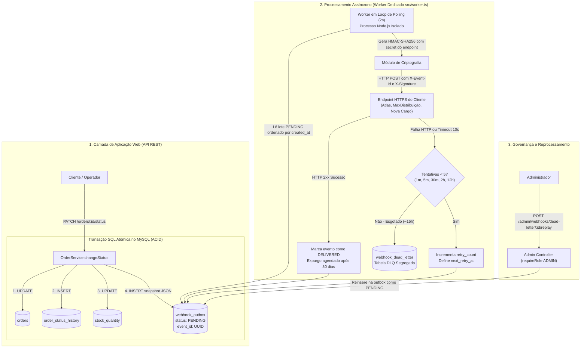
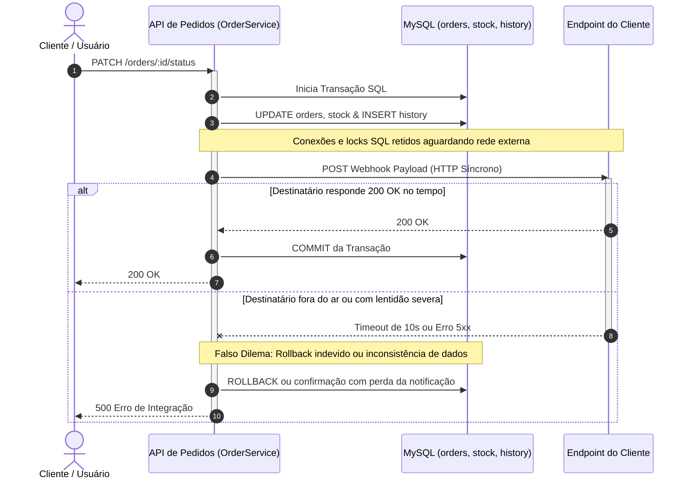
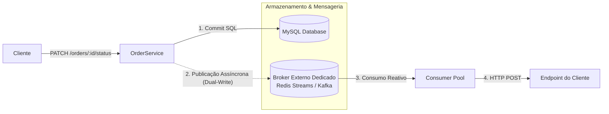

# RFC: Sistema de Webhooks para Notificação de Pedidos

| Campo | Detalhe |
|---|---|
| **Autor(es)** | Larissa (Tech Lead) — com colaboração de Bruno (Eng. Pedidos) e Diego (Eng. Plataforma) |
| **Status** | Em Revisão (Submetido para Revisão Técnica da Equipe) |
| **Data de Criação** | 2026-09-13 |
| **Última Atualização** | 2026-09-17 |
| **Revisores** | Larissa (Tech Lead), Marcos (Product Manager), Bruno (Engenheiro - Pedidos), Diego (Engenheiro - Plataforma), Sofia (Engenheira - Segurança) |
| **Time** | Time de Pedidos & Time de Plataforma |

---

## Resumo Executivo (TL;DR)

Esta RFC propõe a implementação de uma esteira assíncrona de notificações de saída (*outbound webhooks*) para informar parceiros comerciais e clientes B2B em tempo real sobre mudanças no ciclo de vida de seus pedidos. A solução resolve a saturação crítica de conexões e lentidão na API principal (`GET /orders`) provocada por varreduras contínuas (*polling*) de clientes prioritários (Atlas Comercial, MaxDistribuição e Nova Cargo), eliminando o risco imediato de perda de contratos (*churn*). 

O núcleo arquitetural baseia-se na adoção do padrão **Transacional Outbox** integrado atomicamente à transação SQL de alteração de pedidos no banco de dados relacional (MySQL), combinado a um processo consumidor independente (*worker*) executando consultas periódicas (*polling*) a cada 2 segundos. A proposta garante consistência ACID sem escrita dupla, latência ponta a ponta inferior a 10 segundos, entrega *at-least-once*, resiliência via retentativas com *Dead Letter Queue* (DLQ) e autenticação criptográfica HMAC-SHA256, sem introduzir componentes complexos de mensageria externa (como Kafka ou Redis) e cumprindo com segurança o prazo estrito de três *sprints* (fim de novembro de 2026).

---

## Contexto e Problema

### Cenário Atual e Dores de Negócio
Atualmente, os clientes B2B da plataforma consultam periodicamente o endpoint `GET /orders` para identificar se seus pedidos mudaram de estado (ex: de `PENDING` para `PAID` ou `SHIPPED`). Esse modelo de *polling* constante gerou impactos operacionais graves:
1. **Sobrecarga de Infraestrutura:** Consumo excessivo de conexões com o MySQL e degradação de CPU na API de pedidos, encarecendo a infraestrutura e elevando a latência média para todos os usuários.
2. **Pressão Comercial e Risco de Churn:** Três dos maiores clientes corporativos da empresa — Atlas Comercial, MaxDistribuição e Nova Cargo — exigiram formalmente notificações push em tempo real. A Atlas Comercial comunicou formalmente a intenção de rescindir o contrato caso o recurso não entre em produção até o fim de novembro de 2026.
3. **Inviabilidade do Acoplamento Síncrono:** A transição de status no serviço de pedidos (`OrderService.changeStatus`) executa uma transação SQL atômica que atualiza o pedido (`orders`), registra o histórico de auditoria (`order_status_history`) e debita o estoque (`stock_quantity`). Efetuar chamadas HTTP síncronas para servidores externos durante essa transação bloquearia conexões e travas de banco com o tempo de rede de terceiros. Além disso, qualquer falha ou timeout do cliente geraria um falso dilema: reverter uma atualização legítima de pedido ou perder permanentemente a notificação.

### Objetivos (Goals)
- **Latência em Tempo Real:** Assegurar latência ponta a ponta inferior a 10 segundos para 99% dos eventos de alteração de status de pedidos, atendendo ao SLA contratual.
- **Consistência Atômica (Zero Escrita Dupla):** Garantir que nenhuma alteração de status confirmada deixe de gerar seu respectivo evento de notificação e que nenhum evento órfão seja emitido se a transação sofrer *rollback*.
- **Entrega At-Least-Once com Idempotência:** Garantir a persistência e entrega de todos os eventos diante de falhas de rede transitórias, provendo o cabeçalho `X-Event-Id` (UUID v4) para desduplicação idempotente na ponta receptora.
- **Resiliência Automatizada com DLQ:** Implementar política de 5 retentativas com backoff exponencial progressivo (1m, 5m, 30m, 2h, 12h — janela total de ~15h), segregando falhas exauridas em tabela dedicada de *Dead Letter Queue* (`webhook_dead_letter`) com rota de reprocessamento manual administrativo restrita a `ADMIN`.
- **Autenticidade e Integridade Criptográfica:** Assinar o payload de cada disparo via HMAC-SHA256 utilizando segredo exclusivo por endpoint, com janela de carência de 24 horas para suporte a rotação segura e obrigatoriedade de transporte sob HTTPS.

### Não-Objetivos (Non-Goals)
- **Webhooks de Entrada (*Inbound*):** Escopo restrito ao envio de notificações (*outbound*).
- **Interface Gráfica de Usuário (Dashboard):** Toda a gestão será via API RESTful nesta fase; interfaces visuais serão tratadas futuramente pelo time de frontend.
- **Alertas por Canais Secundários (E-mail/SMS):** Notificações ativas por e-mail para falhas sucessivas estão postergadas para etapas subsequentes.
- **Ordenação Global Absoluta:** A ordenação é garantida por pedido (`order_id`) sob a execução de uma instância consumidora única; não há compromisso de ordenação causal entre pedidos de clientes distintos.
- **Novos Componentes de Mensageria:** Não faz parte da proposta provisionar ou manter Apache Kafka, RabbitMQ ou clusters Redis, mantendo o ecossistema centrado no MySQL existente.

---

## Proposta Técnica

### Visão Geral da Solução
A proposta técnica adota o padrão **Transacional Outbox no MySQL** com um **Worker desacoplado via Polling**. A solução opera em três camadas coordenadas:

1. **Gravação Atômica na Origem:** Durante o método `OrderService.changeStatus`, a mesma transação relacional Prisma (`$transaction`) que atualiza o pedido e o inventário realiza a inserção de um registro na tabela `webhook_outbox`. O registro contém o identificador universal do evento (`event_id`), o status inicial `PENDING` e o retrato completo congelado (*snapshot* JSON serializado) do pedido no momento da transição, imune a mutações posteriores.
2. **Processamento Assíncrono Desacoplado:** Um worker dedicado (`src/worker.ts`), executando em processo e ciclo de vida isolados da API web principal, executa varreduras regulares (*polling*) a cada 2 segundos na tabela `webhook_outbox`. O worker recupera lotes pequenos de eventos pendentes ordenados cronologicamente por `created_at`.
3. **Despacho Seguro e Resiliência:** O worker despacha cada requisição HTTP POST sob HTTPS com timeout estrito de 10 segundos, calcula e injeta a assinatura `X-Signature-SHA256` (HMAC-SHA256) no cabeçalho, controla retentativas automáticas e encaminha falhas definitivas para a tabela `webhook_dead_letter`.

### Diagrama Arquitetural da Solução

### Componentes e Padrões Arquiteturais Incorporados
- **Isolamento de Processos:** Separação entre `src/server.ts` (API pública) e `src/worker.ts` (consumidor assíncrono), garantindo que picos de chamadas externas ou falhas de rede de terceiros não saturem o loop de eventos da API.
- **Contrato de Cabeçalhos Padronizados:** Cada webhook trafega com `X-Event-Id` (idempotência), `X-Signature-SHA256` (integridade e autenticidade), `X-Timestamp` (proteção contra repetição) e `X-Webhook-Id` (identificador do endpoint).
- **Reaproveitamento dos Padrões da Codebase:** Alinhamento estrito com as práticas existentes do projeto: estrutura modular em `src/modules/webhooks`, tratamento uniforme de exceções via `AppError`, logs estruturados com identificador de correlação via biblioteca Pino e validação declarativa de schemas via Zod.

---

## Alternativas Consideradas

### Alternativa 1: Disparo Síncrono no Fluxo de Atualização do Pedido (Rejeitada)

**Descrição:**  
A requisição HTTP de notificação é disparada síncronamente logo após a gravação das tabelas de pedidos, dentro do mesmo método de execução do serviço de domínio (`OrderService.changeStatus`).

**Prós:**
- Simplicidade inicial de implementação, sem necessidade de novas tabelas ou workers em segundo plano.
- Entrega imediata em condições ideais de rede.

**Contras e Motivo do Descarte:**
- **Acoplamento Temporal Crítico:** Retém conexões ativas do pool do banco de dados e bloqueios de linha (*row locks*) enquanto aguarda servidores de terceiros.
- **Vulnerabilidade a Falhas em Cascata:** Um cliente lento consome as threads do servidor Node.js, degradando o tempo de resposta da API para todos os demais usuários da plataforma.
- **Inconsistência Transacional:** Na hipótese de timeout remoto, o sistema é forçado a escolher entre cancelar uma operação comercial válida de pedido ou persistir o pedido sem qualquer registro ou garantia de envio da notificação.
- **Descarte:** Rejeitada formalmente por violar a resiliência e a estabilidade da plataforma, conforme fundamentado na [ADR-001: Padrão Transacional Outbox no MySQL](/docs/adrs/ADR-001-padrao-transacional-outbox-no-mysql.md).

---

### Alternativa 2: Mensageria Externa Dedicada — Redis Streams ou Apache Kafka (Rejeitada)

**Descrição:**  
Após o commit no banco relacional, o serviço de pedidos publica o evento em uma fila ou tópico externo dedicado (Redis Streams, Apache Kafka ou RabbitMQ). Um cluster de microsserviços consumidores consome o fluxo de mensagens e efetua os disparos externos.

**Prós:**
- Altíssima capacidade de vazão (dezenas de milhares de eventos por segundo) com latência reativa de milissegundos.
- Deslocamento de offsets e balanceamento de carga nativos por grupos de consumidores (*consumer groups*).

**Contras e Motivo do Descarte:**
- **Problema da Escrita Dupla (*Dual-Write Problem*):** Não é possível garantir transacionalidade atômica entre o commit no MySQL e a publicação na rede externa sem um mecanismo intermediário de outbox. Falhas de rede pós-commit geram eventos perdidos; publicações pré-commit geram notificações fantasmas se o banco sofrer *rollback*.
- **Complexidade Operacional e Custo:** Introduz a necessidade de homologação, provisionamento, configuração de alta disponibilidade e monitoramento de uma nova plataforma distribuída para uma equipe de engenharia enxuta.
- **Inviabilidade de Cronograma:** O esforço operacional extrapola o limite de três *sprints*, tornando impossível a entrega contratual até o fim de novembro de 2026.
- **Descarte:** Rejeitada por sobre-engenharia (*overengineering*) e descumprimento de prazos, conforme consolidado na [ADR-001](/docs/adrs/ADR-001-padrao-transacional-outbox-no-mysql.md) e na [ADR-006: Reaproveitamento Integral dos Padrões da Codebase](/docs/adrs/ADR-006-reaproveitamento-padroes-codebase.md).

---

## Impacto e Riscos

A adoção do padrão Transacional Outbox com processamento assíncrono via Polling foi selecionada como a melhor solução para o contexto da empresa. Contudo, essa escolha impõe impactos específicos e riscos operacionais que devem ser compreendidos, monitorados e mitigados:

### 1. Sobrecarga e Contenção no Banco de Dados Relacional (MySQL)
- **Impacto e Risco:** O ciclo de polling a cada 2 segundos submete a tabela `webhook_outbox` a 30 consultas por minuto, mesmo quando não houver novos eventos a processar. O crescimento contínuo do histórico de eventos pode gerar degradação de performance por inchaço da tabela (*table bloat*) e lentidão nas consultas do worker, competindo por conexões e memória com as tabelas transacionais de pedidos e estoque.
- **Mitigações Arquiteturais:**
  - Criação de índice composto específico e altamente seletivo: `idx_outbox_polling (status, next_retry_at, created_at)`. Esse índice assegura que a consulta de varredura opere em milissegundos via busca de índice (*index seek*), sem causar varredura de tabela (*table scan*).
  - Consulta estritamente limitada em pequenos lotes (`LIMIT 50`) por ciclo de polling, prevenindo picos de consumo de memória no Node.js.
  - Separação de pools de conexões do Prisma entre o worker e a API web, evitando contenção de conexões para as requisições dos usuários.
  - Implementação de rotina programada de arquivamento/expurgo de eventos que permaneçam no estado `DELIVERED` há mais de 30 dias.

### 2. Latência Intrínseca de Polling vs. SLA Contratual
- **Impacto e Risco:** Diferente de uma esteira reativa baseada em eventos (milissegundos), o polling regular introduz um tempo de espera intrínseco de 0 a 2 segundos (média de 1 segundo) antes de o worker identificar e iniciar o despacho da notificação.
- **Mitigações Arquiteturais:**
  - Conforme modelagem matemática de latência ($t_{\text{total}} = t_{\text{transação}} + t_{\text{polling}} + t_{\text{cripto}} + t_{\text{rede}}$), o tempo total ponta a ponta no pior caso de coincidência de ciclo não ultrapassa 4 segundos.
  - A latência observada atende com ampla folga à meta de latência de 10 segundos acordada com Atlas Comercial, MaxDistribuição e Nova Cargo, configurando um trade-off favorável de engenharia.

### 3. Escalabilidade Concorrente e Garantia de Ordenação de Eventos
- **Impacto e Risco:** Na fase inicial, a infraestrutura operará com uma única instância consumidora (*single-worker*), o que garante de forma natural e sequencial a ordem de despacho por `created_at`. No entanto, caso a volumetria cresça a ponto de exigir a execução de múltiplos workers em paralelo no futuro, sem um mecanismo de partição, múltiplos processos concorrentes disputarão os mesmos registros, gerando condição de corrida (*race condition*) e risco de entrega desordenada (ex: o evento `SHIPPED` chegar ao cliente antes de `PAID`).
- **Mitigações Arquiteturais:**
  - O dimensionamento para o primeiro trimestre confirma que um worker único em loop de 2s processa com tranquilidade o volume projetado de dezenas de milhares de eventos diários.
  - Para a evolução de longo prazo, a arquitetura prevê a evolução para consumo particionado por chave (*hash* de `order_id`) ou uso de locks pessimistas com `SELECT ... FOR UPDATE SKIP LOCKED`, garantindo paralelismo sem violação de ordenação por pedido.

### 4. Gestão da Dead Letter Queue (DLQ) e Acúmulo Silencioso de Falhas
- **Impacto e Risco:** Se um parceiro permanecer com seu endpoint inoperante por tempo superior à janela de retentativas (~15 horas), seus eventos serão transferidos para a tabela `webhook_dead_letter`. O acúmulo desassistido de registros na DLQ pode causar impacto nas integrações dos clientes sem que a engenharia tome ciência imediata.
- **Mitigações Arquiteturais:**
  - Disparo de log estruturado via biblioteca Pino com severidade `ERROR` e atributos de contexto (`event_id`, `endpoint_url`, `attempts`, `last_error`) no momento em que a quinta tentativa falhar e o registro for movido para a DLQ.
  - Disponibilização de endpoint administrativo de auditoria e *replay* manual (`POST /admin/webhooks/dead-letter/:id/replay`), devidamente blindado pelo middleware de autorização restrito ao perfil `ADMIN`.
  - Histórico transparente de tentativas mantido em `webhook_deliveries` para diagnóstico imediato de erros HTTP e timeouts.

### 5. Risco de Sobrecarga em Clientes por Ausência de Rate Limiting de Saída
- **Impacto e Risco:** Em momentos de processamento em lote interno (ex: importação de planilha de pagamentos aprovando 50 pedidos no mesmo segundo), o worker processará todos os eventos pendentes e efetuará dezenas de requisições simultâneas para o mesmo destinatário, correndo o risco de sobrecarregar servidores de clientes menos preparados.
- **Mitigações Arquiteturais:**
  - O timeout de saída fixado em 10 segundos e o consumo em lotes de até 50 eventos atuam como amortecedores naturais.
  - A equipe acompanhará ativamente o comportamento volumétrico no primeiro mês de produção para avaliar a introdução oportuna de controle de taxa de saída baseado em algoritmo de *Token Bucket* por endpoint (mantido como Questão em Aberto 1).

### 6. Semântica At-Least-Once e Risco de Duplicatas no Cliente
- **Impacto e Risco:** Diante de instabilidades de rede (ex: o cliente recebe a requisição, processa com sucesso, mas a resposta HTTP 200 sofre timeout ou queda de conexão antes de chegar ao worker), o worker assumirá falha e agendará uma retentativa legítima, resultando em entrega duplicada.
- **Mitigações Arquiteturais:**
  - Envio obrigatório e invariável do cabeçalho `X-Event-Id` contendo o UUID original e imutável do evento gravado na outbox.
  - Formalização contratual e técnica de que a responsabilidade pela desduplicação idempotente cabe ao cliente receptor, com recomendação expressa de retenção do histórico de `X-Event-Id` por pelo menos 24 horas.

---

## Questões em Aberto

1. **Monitoramento e Controle de Vazão de Saída (*Outbound Rate Limiting*):**  
   *Contexto:* Durante a reunião técnica, Diego apontou a preocupação de que clientes com grandes picos simultâneos de pedidos (ex: 50 pedidos transitando de estado simultaneamente) sofram sobrecarga com uma rajada de disparos em sequência.  
   *Inclinação da Equipe:* Na primeira fase, não será implementado limitador de taxa para preservar o cronograma de desenvolvimento. O tráfego real será monitorado em produção e, caso sejam observadas instabilidades nos destinatários, implementará-se um mecanismo de vazão (algoritmo *Token Bucket* por endpoint) no worker.

2. **Notificação Proativa de Clientes por Falha Recorrente (Alertas via E-mail):**  
   *Contexto:* Marcos questionou a viabilidade de disparar e-mails automáticos ao suporte técnico do cliente caso seu endpoint registre 3 falhas consecutivas de entrega.  
   *Inclinação da Equipe:* O recurso foi considerado fora de escopo para a entrega corrente. A equipe manterá o foco na resiliência e na DLQ nesta primeira etapa e avaliará a integração com provedores de mensageria eletrônica no ciclo seguinte à estabilização.

3. **Escalabilidade Horizontal do Worker e Preservação de Ordenação Estrita:**  
   *Contexto:* Larissa e Bruno debateram como garantir que pedidos que mudem de estado em sucessão rápida (`PAID` -> `PROCESSING` -> `SHIPPED`) não tenham seus eventos entregues fora de ordem caso o processamento passe a rodar com múltiplos workers em paralelo.  
   *Inclinação da Equipe:* O sistema iniciará a operação produtiva em modelo de instância única (*single-worker*), que garante ordenação natural e sequencial por `created_at`. Caso haja expansão futura de volume, a arquitetura migrará para partição determinística via *hash* de `order_id` ou uso de `SELECT ... FOR UPDATE SKIP LOCKED` no MySQL.

4. **Granularidade das Permissões de Acesso para Configuração de Webhooks:**  
   *Contexto:* Sofia defendeu que a rota de reprocessamento da DLQ fosse estritamente exclusiva ao perfil `ADMIN`. Marcos e Bruno discutiram se o cadastro e gerenciamento diário de webhooks deveriam exigir papéis diferenciados.  
   *Inclinação da Equipe:* O CRUD cadastral de endpoints será aberto a qualquer usuário autenticado com permissão na organização parceira. A restrição rígida aplica-se à rota de *replay* da DLQ (`requireRole('ADMIN')`). A criação de papéis mais granulares para integração técnica será revista de acordo com o feedback de conformidade dos clientes.

---

## Decisões Relacionadas (ADRs)

A proposta arquitetural consolidada nesta RFC fundamenta-se nas seguintes decisões formais de arquitetura do projeto:

- [ADR-001: Padrão Transacional Outbox no MySQL](/docs/adrs/ADR-001-padrao-transacional-outbox-no-mysql.md) — Estabelece a persistência atômica do evento na mesma transação relacional do pedido, eliminando a inconsistência de escrita dupla.
- [ADR-002: Worker Desacoplado via Polling](/docs/adrs/ADR-002-worker-desacoplado-via-polling.md) — Define a segregação operacional do worker assíncrono em processo Node.js dedicado (`src/worker.ts`) e o intervalo de consulta periódica de 2 segundos.
- [ADR-003: Garantia de Entrega At-Least-Once com Desduplicação por Event ID](/docs/adrs/ADR-003-garantia-entrega-at-least-once-com-desduplicacao-event-id.md) — Normatiza o contrato de retransmissão de eventos e a delegação de desduplicação idempotente na ponta receptora via `X-Event-Id`.
- [ADR-004: Política de Retry com Backoff Exponencial e Tabela DLQ Dedicada](/docs/adrs/ADR-004-politica-retry-backoff-exponencial-tabela-dlq.md) — Especifica a progressão matemática de 5 tentativas de retentativa (~15h), o transbordo para a tabela de mensagens mortas e a rota de *replay* administrativo restrita a `ADMIN`.
- [ADR-005: Autenticação e Integridade via HMAC-SHA256 com Secret por Endpoint](/docs/adrs/ADR-005-autenticacao-integridade-hmac-sha256-secret-por-endpoint.md) — Padroniza a segurança criptográfica via cabeçalho `X-Signature-SHA256`, chaves exclusivas por webhook, suporte a rotação com carência de 24 horas e timeout de 10 segundos.
- [ADR-006: Reaproveitamento Integral dos Padrões da Codebase](/docs/adrs/ADR-006-reaproveitamento-padroes-codebase.md) — Garante a aderência às convenções arquiteturais existentes do sistema: padrão modular sob `src/modules/webhooks`, tipagem de erros `AppError` com prefixo `WEBHOOK_*`, esquemas declarativos Zod e registros estruturados Pino.