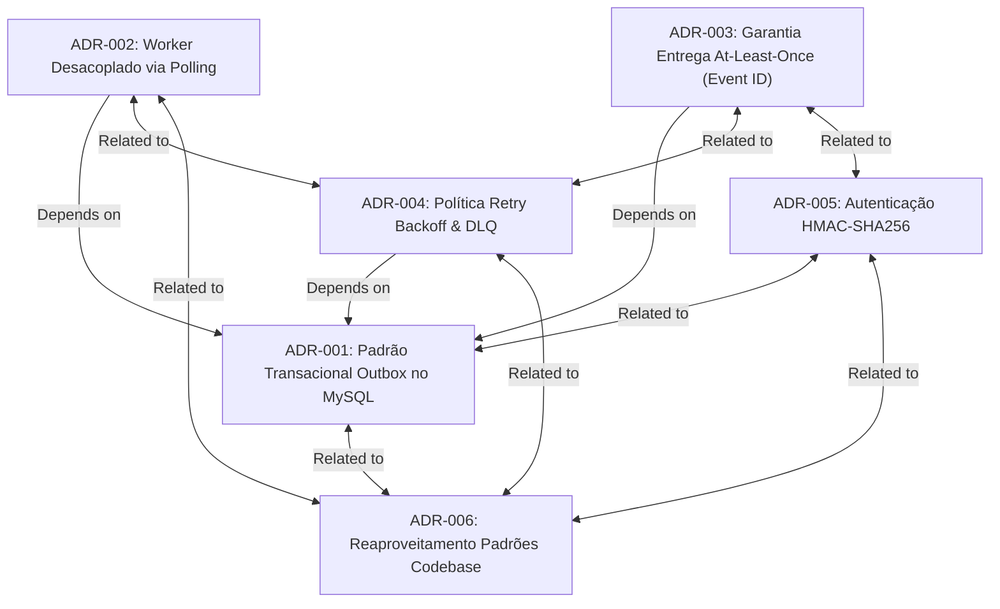

# ADR Relationship Analysis Report

**Generated:** 2026-09-15 18:45
**Scope:** `docs/adrs/generated/WEBHOOKS` and `docs/adrs/`
**Target Standard:** MADR (Markdown Architectural Decision Records)

## Executive Summary

- **Processed:** 6 ADRs in module `WEBHOOKS` (mirrored in `docs/adrs/` and `docs/adrs/generated/WEBHOOKS/`)
- **Total Relationships Detected:** 11 bidirectional pairs (22 links per directory, 44 links verified total)
- **Files Modified:** 6 ADRs per directory (12 file updates)
- **Format Integrity:** 100% compliant with MADR standard and relative Markdown link requirements.
- **Link Integrity:** 100% verified (0 broken links, 0 orphaned links).

## Relationship Breakdown

| Relationship Type | Pairs | Total Link Updates (per dir) | Semantic Meaning |
|---|---|---|---|
| **Depends on ↔ Used by** | 3 pairs | 6 link entries | Direct architectural dependency |
| **Related to ↔ Related to** | 8 pairs | 16 link entries | Domain / complementary relationship |
| **Supersedes ↔ Superseded by** | 0 pairs | 0 link entries | Version replacement (none in v1) |
| **Amends ↔ Amended by** | 0 pairs | 0 link entries | Partial modifications (none in v1) |
| **Total** | **11 pairs** | **22 links** | **100% Bidirectional** |

## Dependency Graph (DAG)

## Detailed Relationship Analysis

### 1. ADR-001: Padrão Transacional Outbox no MySQL
- **Used by:**
  - `[ADR-002: Worker Desacoplado via Polling](../ADR-002-worker-desacoplado-via-polling.md)`
    - *Rationale:* O worker em processo desacoplado consome diretamente os registros da tabela outbox criada na transação de domínio.
  - `[ADR-003: Garantia de Entrega At-Least-Once com Desduplicação por Event ID](../ADR-003-garantia-entrega-at-least-once-com-desduplicacao-event-id.md)`
    - *Rationale:* A garantia at-least-once baseia-se no UUID do evento gravado atomicamente na outbox.
  - `[ADR-004: Política de Retry com Backoff Exponencial e Tabela DLQ Dedicada](../ADR-004-politica-retry-backoff-exponencial-tabela-dlq.md)`
    - *Rationale:* A contagem de tentativas e o controle de estado de entrega operam diretamente sobre a outbox relacional.
- **Related to:**
  - `[ADR-005: Autenticação e Integridade via HMAC-SHA256 com Secret por Endpoint](../ADR-005-autenticacao-integridade-hmac-sha256-secret-por-endpoint.md)`
    - *Rationale:* A assinatura HMAC é calculada sobre o payload imutável serializado no momento da inserção na outbox.
  - `[ADR-006: Reaproveitamento Integral dos Padrões da Codebase](../ADR-006-reaproveitamento-padroes-codebase.md)`
    - *Rationale:* Preservada relação com os padrões da base de código (MySQL/Prisma e transações de domínio).

### 2. ADR-002: Worker Desacoplado via Polling
- **Depends on:**
  - `[ADR-001: Padrão Transacional Outbox no MySQL](../ADR-001-padrao-transacional-outbox-no-mysql.md)`
    - *Rationale:* O processador assíncrono executa varredura a cada 2s sobre a tabela outbox; sem esta, não há substrato de consumo.
- **Related to:**
  - `[ADR-004: Política de Retry com Backoff Exponencial e Tabela DLQ Dedicada](../ADR-004-politica-retry-backoff-exponencial-tabela-dlq.md)`
    - *Rationale:* O worker é o agente executor das retentativas com backoff exponencial e da movimentação para DLQ.
  - `[ADR-006: Reaproveitamento Integral dos Padrões da Codebase](../ADR-006-reaproveitamento-padroes-codebase.md)`
    - *Rationale:* O worker reutiliza a infraestrutura central de banco de dados (`src/config/database.ts`) e o logger Pino.

### 3. ADR-003: Garantia de Entrega At-Least-Once com Desduplicação por Event ID
- **Depends on:**
  - `[ADR-001: Padrão Transacional Outbox no MySQL](../ADR-001-padrao-transacional-outbox-no-mysql.md)`
    - *Rationale:* Depende da gravação transacional atômica do `eventId` persistido na outbox.
- **Related to:**
  - `[ADR-004: Política de Retry com Backoff Exponencial e Tabela DLQ Dedicada](../ADR-004-politica-retry-backoff-exponencial-tabela-dlq.md)`
    - *Rationale:* A semântica at-least-once decorre diretamente das 5 retentativas automatizadas; a janela de desduplicação de 24h cobre a janela de retry (~15h).
  - `[ADR-005: Autenticação e Integridade via HMAC-SHA256 com Secret por Endpoint](../ADR-005-autenticacao-integridade-hmac-sha256-secret-por-endpoint.md)`
    - *Rationale:* Decisões complementares de protocolo e cabeçalhos HTTP (`X-Event-Id`, `X-Timestamp`, `X-Signature-SHA256`).

### 4. ADR-004: Política de Retry com Backoff Exponencial e Tabela DLQ Dedicada
- **Depends on:**
  - `[ADR-001: Padrão Transacional Outbox no MySQL](../ADR-001-padrao-transacional-outbox-no-mysql.md)`
    - *Rationale:* O ciclo de vida de retentativas atualiza os registros de outbox e direciona falhas permanentes para a tabela dedicada de mensagens mortas.
- **Related to:**
  - `[ADR-002: Worker Desacoplado via Polling](../ADR-002-worker-desacoplado-via-polling.md)`
    - *Rationale:* O algoritmo de backoff é executado pelo loop de polling do worker assíncrono.
  - `[ADR-003: Garantia de Entrega At-Least-Once com Desduplicação por Event ID](../ADR-003-garantia-entrega-at-least-once-com-desduplicacao-event-id.md)`
    - *Rationale:* A janela operacional de retentativas de ~15h define o SLA de retenção de idempotência no consumidor (24h).
  - `[ADR-006: Reaproveitamento Integral dos Padrões da Codebase](../ADR-006-reaproveitamento-padroes-codebase.md)`
    - *Rationale:* O endpoint de reprocessamento manual utiliza o middleware `requireRole('ADMIN')` e as classes padronizadas `AppError`.

### 5. ADR-005: Autenticação e Integridade via HMAC-SHA256 com Secret por Endpoint
- **Related to:**
  - `[ADR-001: Padrão Transacional Outbox no MySQL](../ADR-001-padrao-transacional-outbox-no-mysql.md)`
    - *Rationale:* A integridade da assinatura criptográfica depende da imutabilidade do payload serializado na gravação da outbox.
  - `[ADR-003: Garantia de Entrega At-Least-Once com Desduplicação por Event ID](../ADR-003-garantia-entrega-at-least-once-com-desduplicacao-event-id.md)`
    - *Rationale:* Conjunto padronizado de cabeçalhos de contrato de webhook (`X-Signature-SHA256`, `X-Event-Id`, `X-Timestamp`).
  - `[ADR-006: Reaproveitamento Integral dos Padrões da Codebase](../ADR-006-reaproveitamento-padroes-codebase.md)`
    - *Rationale:* Reutilização do subsistema de variáveis de ambiente (`src/config/env.ts`) e classes de validação Zod.

### 6. ADR-006: Reaproveitamento Integral dos Padrões da Codebase
- **Related to:**
  - `[ADR-001: Padrão Transacional Outbox no MySQL](../ADR-001-padrao-transacional-outbox-no-mysql.md)`
  - `[ADR-002: Worker Desacoplado via Polling](../ADR-002-worker-desacoplado-via-polling.md)`
  - `[ADR-004: Política de Retry com Backoff Exponencial e Tabela DLQ Dedicada](../ADR-004-politica-retry-backoff-exponencial-tabela-dlq.md)`
  - `[ADR-005: Autenticação e Integridade via HMAC-SHA256 com Secret por Endpoint](../ADR-005-autenticacao-integridade-hmac-sha256-secret-por-endpoint.md)`
  - *Rationale:* ADR-006 formaliza a diretriz transversal de reaproveitamento integral dos padrões de código (`src/modules/webhooks`, `AppError`, `error.middleware.ts`, `requireRole`, Pino logger). Como decisão transversal/fundacional, está conectada a todas as decisões do módulo via `Related to`, preservando as 4 relações manuais preexistentes.

## Rule Adherence & Quality Metrics

- **Max Limits Compliance:**
  - `Depends on` limit: Max 3 (Highest count: 1 in ADR-002, ADR-003, ADR-004) -> **PASSED**
  - `Related to` limit: Max 3 (ADR-001: 2, ADR-002: 2, ADR-003: 2, ADR-004: 3, ADR-005: 3) -> **PASSED**
  - Exception handling: ADR-006 preserves 4 manual relationships (exceeds recommended 3-link threshold, allowed under manual exception clause) -> **PASSED**
- **Foundational Exclusion Rule:** ADR-006 is excluded as a dependency target (not linked as `Depends on`), linked purely as `Related to`. -> **PASSED**
- **Cycle Detection:** No circular dependencies found (ADR-002, ADR-003, ADR-004 depend on ADR-001; ADR-001 depends on none). -> **PASSED**
- **Content Integrity:** Headers updated exclusively; body content preserved 100% byte-for-byte. -> **PASSED**
